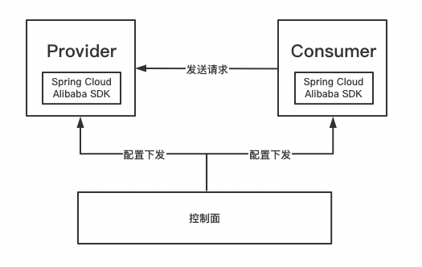
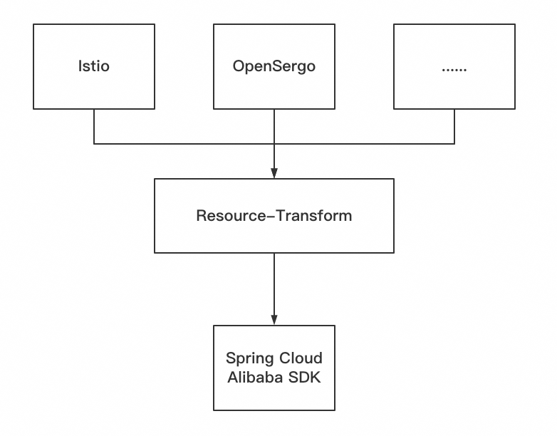
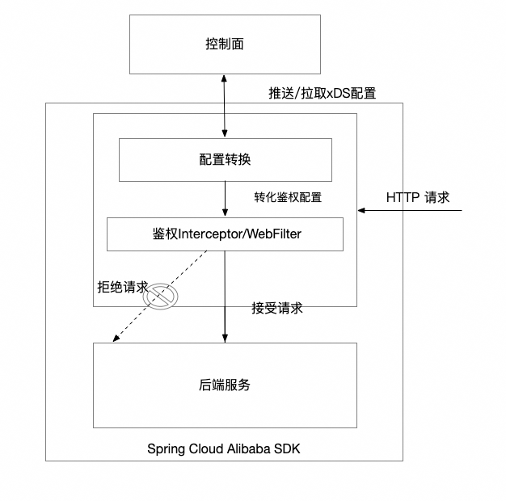

== Spring Cloud Alibaba Governance

Spring Cloud Alibaba Governance模块是Spring Cloud Alibaba推出的微服务治理子模块，提供了多种类型的微服务治理能力，包括标签路由，服务鉴权等。并且对接了多种控制面，比如Istio，OpenSergo，让用户无需改造Spring Cloud应用，也能实时感知到Istio等治理控制面下发的治理规则，并将此规则应用到Spring Cloud应用上，从而完成对Spring Cloud应用的治理。

== 如何使用
=== 配置转换

Spring Cloud Alibaba Governance的resource-transform模块会将不同控制面下发的配置进行统一的转换，将来自Istio，OpenSergo等控制面下发的配置统一转换为Spring Cloud Alibaba统一抽象出的数据结构以供后续使用

如果在您的项目中使用Istio来实现配置转换，需要使用group ID 为 `com.alibaba.cloud` 和artifact ID 为 `spring-cloud-starter-alibaba-controlplane-istio` 的starter
[source,xml,indent=0]
----
<dependency>
  <groupId>com.alibaba.cloud</groupId>
  <artifactId>spring-cloud-starter-alibaba-controlplane-istio</artifactId>
</dependency>
----

之后，在application.yml配置文件中配置如下配置

[source,yaml,indent=0]
----
server:
  port: ${SERVER_PORT:80}
spring:
  cloud:
    governance:
      auth:
        enabled: ${ISTIO_AUTH_ENABLE:true}
    istio:
      config:
        enabled: ${ISTIO_CONFIG_ENABLE:true}
        host: ${ISTIOD_ADDR:127.0.0.1}
        port: ${ISTIOD_PORT:15010}
        polling-pool-size: ${POLLING_POOL_SIZE:10}
        polling-time: ${POLLING_TIMEOUT:10}
        istiod-token: ${ISTIOD_TOKEN:}
        log-xds: ${LOG_XDS:true}
----

各字段的含义如下:
|===
|配置项|key|默认值|说明
|是否开启鉴权| spring.cloud.governance.auth.enabled|true|
|是否连接Istio获取鉴权配置| spring.cloud.istio.config.enabled|true|
|Istiod的地址| spring.cloud.istio.config.host|127.0.0.1|
|Istiod的端口| spring.cloud.istio.config.port|15012|注：连接15010端口无需TLS，连接15012端口需TLS认证
|SCA去Istio拉取配置的线程池大小| spring.cloud.istio.config.polling-pool-size|10|
|SCA去Istio拉取配置的间隔时间| spring.cloud.istio.config.polling-time|30|单位为秒
|连接Istio 15012端口时使用的JWT token| spring.cloud.istio.config.istiod-token|应用所在pod的 `/var/run/secrets/tokens/istio-token` 文件的内容|
|是否打印xDS相关日志| spring.cloud.istio.config.log-xds|true|
|===

=== 运行应用
需要将应用运行在K8s环境中，并给运行的应用将K8s的一些元信息注入以下环境变量中:

|===
|环境变量名|K8s pod metadata name
|POD_NAME|metadata.name
|NAMESPACE_NAME|metadata.namespace
|===

=== 使用标签路由
在引入配置转换模块后，我们就能获取到相应的治理规则来对Spring Cloud应用赋予相应的治理能力。标签路由模块可以实现对Spring Cloud应用根据请求头，请求参数等标签来路由到不同的服务

如果在您的项目中使用Spring Cloud Alibaba Governance 标签路由，需要使用需要使用group ID 为 `com.alibaba.cloud` 和artifact ID 为 `spring-cloud-starter-alibaba-governance-routing` 的starter

=== 运行应用
需要将应用运行在K8s环境中，并给运行的应用将K8s的一些元信息注入以下环境变量中:

|===
|环境变量名|K8s pod metadata name
|POD_NAME|metadata.name
|NAMESPACE_NAME|metadata.namespace
|===

=== 使用标签路由
在引入配置转换模块后，我们就能获取到相应的治理规则来对Spring Cloud应用赋予相应的治理能力。标签路由模块可以实现对Spring Cloud应用根据请求头，请求参数等标签来路由到不同的服务

如果在您的项目中使用Spring Cloud Alibaba Governance 标签路由，需要使用需要使用group ID 为 `com.alibaba.cloud` 和artifact ID 为 `spring-cloud-starter-alibaba-governance-routing` 的starter
[source,xml,indent=0]
----
<dependency>
  <groupId>com.alibaba.cloud</groupId>
  <artifactId>spring-cloud-starter-alibaba-governance-routing</artifactId>
</dependency>
----

在引入Istio配置转换模块的前提下，标签路由模块支持对以下几种请求的元信息做路由

* 请求路径
* 请求头
* 请求参数

我们使用Istio下发对应的 `DestinationRule` 以及 `VirtualService` ，即可配置对应的标签路由规则，具体的配置方法请参考以下文档与示例

* https://istio.io/latest/zh/docs/reference/config/networking/virtual-service/#VirtualService
* https://istio.io/latest/zh/docs/concepts/traffic-management/#destination-rules
* spring-cloud-alibaba-examples/governance-example/label-routing-example/istio-label-routing-consumer-example

=== 使用服务鉴权

在引入配置转换模块后，我们就能获取到相应的治理规则来对Spring Cloud应用赋予相应的治理能力。服务鉴权模块给Spring Cloud应用提供多种鉴权方式，如IP黑白名单，JWT鉴权等

如果在您的项目中使用Spring Cloud Alibaba Governance 标签路由，需要使用需要使用group ID 为 `com.alibaba.cloud` 和artifact ID 为 `spring-cloud-starter-alibaba-governance-auth` 的starter
[source,xml,indent=0]
----
<dependency>
  <groupId>com.alibaba.cloud</groupId>
  <artifactId>spring-cloud-starter-alibaba-governance-auth</artifactId>
</dependency>
----

我们使用Istio下发对应的 `AuthorizationPolicy` 以及 `RequestAuthentication` ，即可配置对应的鉴权规则，具体的配置方法请参考以下文档与示例

* https://istio.io/latest/zh/docs/reference/config/security/request_authentication/
* https://istio.io/latest/zh/docs/reference/config/security/authorization-policy/
* spring-cloud-alibaba-examples/governance-example/authentication-example/istio-authentication-provider-mvc-example
* spring-cloud-alibaba-examples/governance-example/authentication-example/istio-authentication-provider-webflux-example