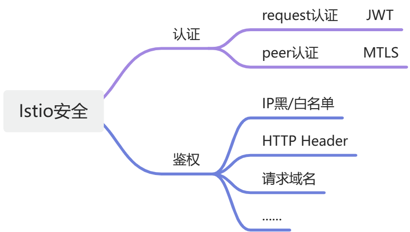
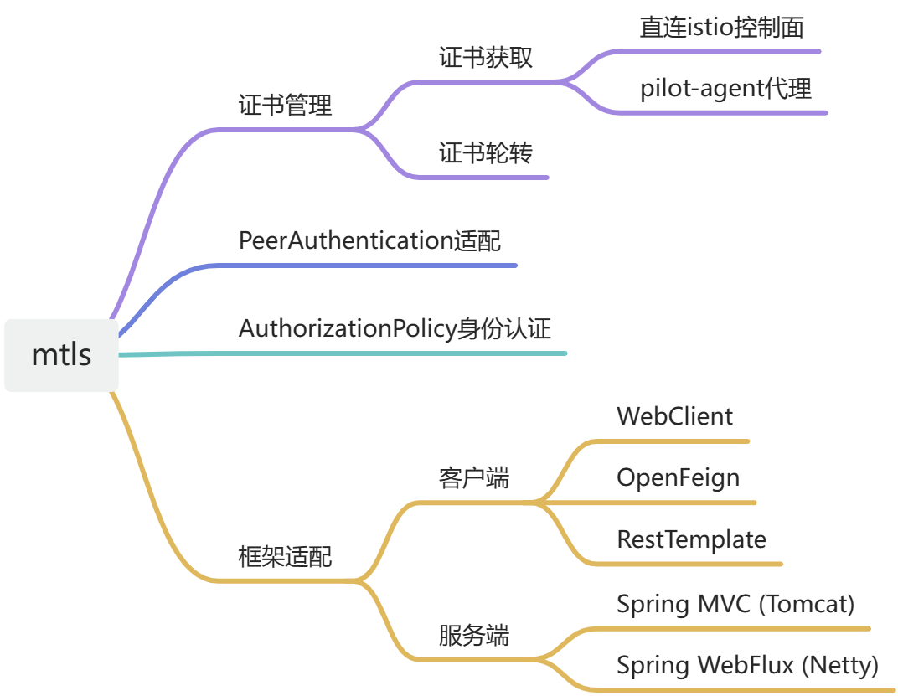
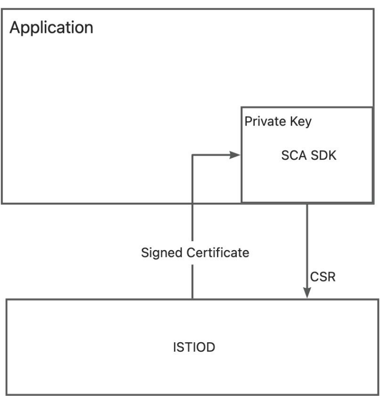
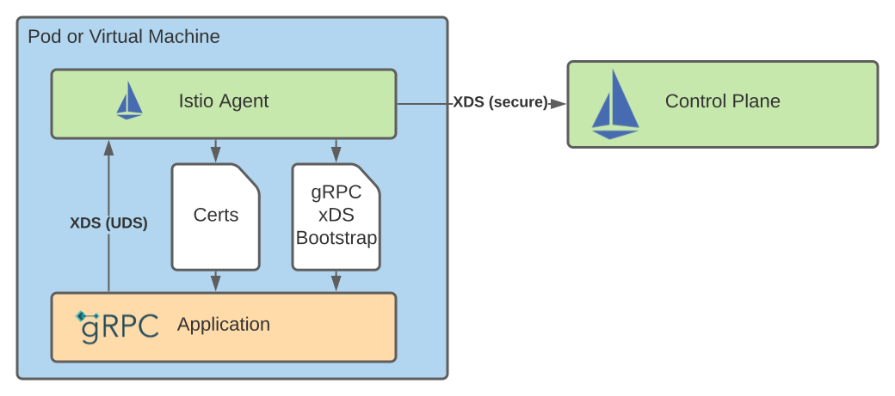

== Spring Cloud Alibaba Mtls

=== 零信任安全

==== 介绍

零信任（Zero Trust）是一种设计安全防护架构的方法，它的核心思路是：默认情况下，所有交互都是不可信的。这与传统的架构相反，后者可能会根据通信是否始于防火墙内部来判断是否可信。零信任架构则摒弃了这种隐式的信任模型，强调在每个交互环节都进行验证和授权。

具体而言，零信任力求弥合依赖隐式信任模型和一次性身份验证的安全防护架构之间的缺口。在零信任架构中，所有用户、设备和应用程序都被视为潜在的威胁，需要进行身份验证和授权，无论它们是否位于内部网络。零信任实施以身份为中心的访问控制机制，基于“持续验证+动态授权”的模式构筑安全基石。

==== Istio如何实现零信任安全

如上图所示，Istio提供两种类型的认证：

（1）Request Authentication

用于终端用户认证，以验证附加到请求的凭据。这种认证方式用于验证终端用户的身份，以便在服务中进行更细粒度的访问控制和授权。Istio 可以集成多种用户认证机制，如基于JSON Web Token (JWT) 的认证、OAuth 2.0、OpenID Connect等。

（2）Peer Authentication

用于服务到服务的认证，以验证建立连接的客户端。使用传输层安全（Transport Layer Security，TLS）协议为服务之间的通信提供加密和身份验证。每个服务都有一个独特的服务账户，并使用数字证书进行身份验证。这种认证机制确保只有经过身份验证的服务才能相互通信，防止未经授权的服务接入。

Spring Cloud Alibaba已经实现了RequestAuthentication和鉴权的内容（参考 https://github.com/alibaba/spring-cloud-alibaba/blob/2.2.x/spring-cloud-alibaba-docs/src/main/asciidoc-zh/governance.adoc[文档:Spring Cloud Alibaba Governance]及 https://github.com/alibaba/spring-cloud-alibaba/tree/2.2.x/spring-cloud-alibaba-examples/governance-example/authentication-example[示例:Spring Cloud Alibaba Authorization Examples]），因此本文档主要介绍PeerAuthentication相关的内容。

Istio提供了双向TLS作为PeerAuthentication的全栈解决方案，其包括：

1. 为每个服务提供强大的身份，表示其角色，以实现跨群集和云的互操作性，参考 https://istio.io/latest/zh/docs/concepts/security/#istio-identity[Istio身份]。在Kubernetes平台上，可以使用Kubernetes Service Account标识工作负载的身份；

2. 保护服务到服务的通信；

3. 提供密钥管理系统，以自动进行密钥和证书的生成，分发和轮换，参考 https://istio.io/latest/zh/docs/concepts/security/#PKI[身份和证书管理]。

=== Spring Cloud Alibaba Mtls模块简介

Spring Cloud Alibaba Mtls 关注服务到服务的认证，通过添加spring-cloud-starter-mtls模块，就可以为 Spring Cloud Alibaba 应用实现双向TLS能力。

如下图所示，spring-cloud-starter-mtls模块提供了证书管理、流量模式切换的功能，支持 AuthorizationPolicy principals 授权策略配置，并为多种客户端/服务器实现提供了使用双向TLS交互的能力。

==== 证书管理

===== 证书获取

首先注意需要搭建一个Kubernetes集群，并且在其中部署Istio，具体参考 https://istio.io/latest/zh/docs/setup/install[Istio安装]。然后在需要实现mtls能力的应用中添加如下starter依赖：
[source,xml,indent=0]
----
<dependency>
  <groupId>com.alibaba.cloud</groupId>
  <artifactId>spring-cloud-starter-xds-adapter</artifactId>
</dependency>
----

连接 Istio 控制面有直连、注入pilot-agent两种方式，参考 https://github.com/alibaba/spring-cloud-alibaba/blob/2.2.x/spring-cloud-alibaba-docs/src/main/asciidoc-zh/governance.adoc[Spring Cloud Alibaba Governance]。

在 `application.yml` 配置文件中添加如下内容：

[source,yaml,indent=0]
----
spring:
  cloud:
    mtls:
      config:
        enabled: ${MTLS_ENABLE:true}
        server-tls: ${SERVER_TLS:true}
----

字段含义如下:
|===
|配置项|key|默认值
|是否开启mtls| spring.cloud.mtls.enabled|true
|是否以tls流量模式启动| spring.cloud.server-tls.enabled|true
|===

====== 直连Istio控制面

对于Proxyless模式的Spring Cloud Alibaba应用，无需使用envoy proxy，Spring Cloud Alibaba的SDK可以直接扮演 istio-agent 的角色，直接在SDK里为此应用生成私钥，以及向Istio控制面申请证书。

要在直连istio控制面时连接istio控制面的15012端口，需要将此应用的 Service Account 作为 projected volumn 挂载到k8s的 /var/run/secrets/tokens/istio-token 路径上，具体操作见 https://github.com/alibaba/spring-cloud-alibaba/blob/2.2.x/spring-cloud-alibaba-docs/src/main/asciidoc-zh/governance.adoc[Spring Cloud Alibaba Governance]。

====== 注入pilot-agent

如上图所示，参考 https://istio.io/latest/blog/2021/proxyless-grpc/[Istio / gRPC Proxyless Service Mesh] 的实现方式，可以将 pilot-agent 作为xDS协议的统一代理，在添加 inject.istio.io/templates: grpc-agent 注解之后，Spring Cloud Alibaba应用将会获取到 pilot-agent 生成的bootstrap文件，文件中将会保存证书相关的路径以及证书过期时间。

===== 证书轮转

spring-cloud-starter-mtls模块会定期更新证书，保证证书的有效性，用户不需要手动操作。

==== 流量模式切换

Spring Cloud Alibaba Mtls模块支持通过Actuator端点赋予应用动态切换http/https模式的能力。在应用中添加如下依赖：

[source,xml,indent=0]
----
<dependency>
    <groupId>org.springframework.boot</groupId>
    <artifactId>spring-boot-starter-actuator</artifactId>
</dependency>
----

并且在 `application.yml` 中配置对外暴露Actuator端点：

[source,yaml,indent=0]
----
management:
  endpoints:
    web:
      exposure:
        include: "*"
----

配置后，即可通过消费Actuator端点实现http/https模式的切换，具体参考 https://github.com/alibaba/spring-cloud-alibaba/tree/2.2.x/spring-cloud-alibaba-examples/mtls-example[Spring Cloud Alibaba Mtls Examples]。

==== AuthorizationPolicy授权策略

Istio通过授权策略对服务器端的入站流量实施访问控制，参考 https://istio.io/latest/zh/docs/concepts/security/#authorization-policies[authorization-policies]。

spring-cloud-starter-alibaba-governance-auth模块为应用提供了多种鉴权能力，具体可参考参考 https://github.com/alibaba/spring-cloud-alibaba/blob/2.2.x/spring-cloud-alibaba-docs/src/main/asciidoc-zh/governance.adoc[Spring Cloud Alibaba Governance]。使用Spring Cloud Alibaba服务鉴权功能，需要添加如下依赖：

[source,xml,indent=0]
----
<dependency>
  <groupId>com.alibaba.cloud</groupId>
  <artifactId>spring-cloud-starter-alibaba-governance-auth</artifactId>
</dependency>
----

并且在 `application.yml` 中启用鉴权：

[source,yaml,indent=0]
----
spring:
  cloud:
    governance:
      auth:
        enabled: ${ISTIO_AUTH_ENABLE:true}
----

在确保引入了spring-cloud-starter-mtls模块，并启用TLS流量模式后，接下来即可在Spring Cloud Alibaba应用所在pod上应用具体的授权策略配置，具体可参考 https://istio.io/latest/zh/docs/reference/config/security/authorization-policy/[istio / authorization-policy] 及示例 https://github.com/alibaba/spring-cloud-alibaba/tree/2.2.x/spring-cloud-alibaba-examples/mtls-example[Spring Cloud Alibaba Mtls Examples]。

==== 框架适配

===== 服务端

针对Spring MVC(tomcat)，以及Spring Webflux(Netty)提供了istio证书的自动加载以及热更新。

===== 客户端

针对feign，resttemplate等客户端的实现，提供了具有热更新能力的ssl上下文，用户配置后可自动进行istio证书的更新。

具体示例可参考 https://github.com/alibaba/spring-cloud-alibaba/tree/2.2.x/spring-cloud-alibaba-examples/mtls-example[Spring Cloud Alibaba Mtls Examples]。