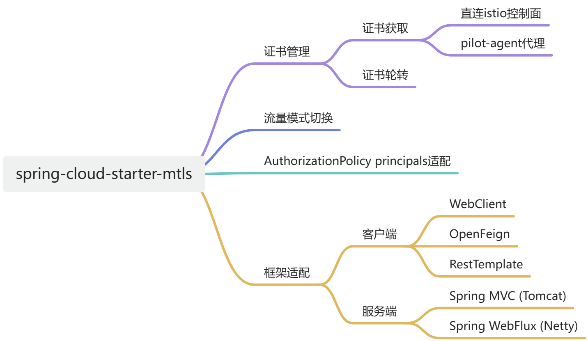

== Spring Cloud Alibaba Mtls

=== 零信任安全

==== 介绍

零信任（Zero Trust）是一种设计安全防护架构的方法，它的核心思路是：默认情况下，所有交互都是不可信的。这与传统的架构相反，后者可能会根据通信是否始于防火墙内部来判断是否可信。零信任架构则摒弃了这种隐式的信任模型，强调在每个交互环节都进行验证和授权。

具体而言，零信任力求弥合依赖隐式信任模型和一次性身份验证的安全防护架构之间的缺口。在零信任架构中，所有用户、设备和应用程序都被视为潜在的威胁，需要进行身份验证和授权，无论它们是否位于内部网络。零信任实施以身份为中心的访问控制机制，基于“持续验证+动态授权”的模式构筑安全基石。

==== Istio如何实现零信任安全

image::pic/istio-security.png[width=50%,align=center]

如上图所示，Istio提供两种类型的认证：

（1）Request认证

用于终端用户认证，以验证附加到请求的凭据。这种认证方式用于验证终端用户的身份，以便在服务中进行更细粒度的访问控制和授权。Istio 可以集成多种用户认证机制，如基于JSON Web Token (JWT) 的认证、OAuth 2.0、OpenID Connect等。

（2）Peer认证

用于服务到服务的认证，以验证建立连接的客户端。使用传输层安全（Transport Layer Security，TLS）协议为服务之间的通信提供加密和身份验证。每个服务都有一个独特的服务账户，并使用数字证书进行身份验证。这种认证机制确保只有经过身份验证的服务才能相互通信，防止未经授权的服务接入。

Spring Cloud Alibaba已经实现了Request认证和鉴权的内容（参考 https://github.com/alibaba/spring-cloud-alibaba/blob/2.2.x/spring-cloud-alibaba-docs/src/main/asciidoc-zh/governance.adoc[文档:Spring Cloud Alibaba Governance]及 https://github.com/alibaba/spring-cloud-alibaba/tree/2.2.x/spring-cloud-alibaba-examples/governance-example/authentication-example[示例:Spring Cloud Alibaba Authorization Examples]），因此Spring Cloud Alibaba Mtls关注Peer认证的内容。

Istio提供了双向TLS作为Peer authentication的全栈解决方案，其包括：

1)为每个服务提供强大的身份，表示其角色，以实现跨群集和云的互操作性，参考 https://istio.io/latest/zh/docs/concepts/security/#istio-identity[Istio身份]。在Kubernetes平台上，可以使用Kubernetes service account标识工作负载的身份；

2)保护服务到服务的通信；

3)提供密钥管理系统，以自动进行密钥和证书的生成，分发和轮换，参考 https://istio.io/latest/zh/docs/concepts/security/#PKI[身份和证书管理]。

=== 在Spring Cloud Alibaba中实现Peer认证

Spring Cloud Alibaba Mtls 关注 Peer authentication，即服务到服务的认证。通过添加特定的Starter模块，就可以为 Spring Cloud Alibaba 应用实现双向TLS能力。

==== 证书管理

===== 证书获取

image::pic/apply-for-certificate.png[width=50%,align=center]

首先注意需要搭建一个Kubernetes集群，并且在其中部署Istio，具体参考 https://istio.io/latest/zh/docs/setup/install[Istio安装]。然后在需要实现mtls能力的应用中添加如下starter依赖：
[source,xml,indent=0]
----
<dependency>
  <groupId>com.alibaba.cloud</groupId>
  <artifactId>spring-cloud-starter-xds-adapter</artifactId>
</dependency>
----
====== 直连Istio控制面

image::pic/connect-directly-to-Istiod.png[width=50%,align=center]

对于Proxyless模式的Spring Cloud Alibaba应用，无需使用envoy proxy，Spring Cloud Alibaba的SDK可以直接扮演 istio-agent 的角色，直接在SDK里为此应用生成私钥，以及向Istio控制面申请证书。

在 `application.yml` 配置文件中设置如下配置内容：

[source,yaml,indent=0]
----
management:
  endpoints:
    web:
      exposure:
        include: "*"
server:
  port: ${SERVER_PORT:80}
spring:
  cloud:
    mtls:
      config:
        enabled: ${MTLS_ENABLE:true}
        server-tls: ${SERVER_TLS:true}
    governance:
      auth:
        enabled: ${ISTIO_AUTH_ENABLE:true}
    istio:
      config:
        enabled: ${ISTIO_CONFIG_ENABLE:true}
        host: ${ISTIOD_ADDR:127.0.0.1}
        port: ${ISTIOD_PORT:15012}
        use-agent: ${USE_AGENT:false}
        namespace-name: ${NAMESPACE_NAME:default}
        istiod-token: ${ISTIOD_TOKEN:}
----

要在直连istio控制面时连接istio控制面的15012端口，需要将此应用的 service account 作为 projected volumn 挂载到k8s的 /var/run/secrets/tokens/istio-token 路径上，具体操作见 https://github.com/alibaba/spring-cloud-alibaba/blob/2.2.x/spring-cloud-alibaba-docs/src/main/asciidoc-zh/governance.adoc[Spring Cloud Alibaba Governance]。

====== 注入pilot-agent

image::pic/pilot-agent-as-agent.svg[width=70%,align=center]

如上图所示，参考 https://istio.io/latest/blog/2021/proxyless-grpc/[Istio / gRPC Proxyless Service Mesh] 的实现方式，可以将 pilot-agent 作为xDS协议的统一代理，在添加 inject.istio.io/templates: grpc-agent 注解之后，Spring Cloud Alibaba应用将会获取到 pilot-agent 生成的bootstrap文件，文件中将会保存证书相关的路径以及证书过期时间。

需要在Spring Cloud Alibaba应用所在pod上加上如下 `annotation`：

[source,yaml,indent=0]
----
template:
    metadata:
      annotations:
        inject.istio.io/templates: grpc-agent
        proxy.istio.io/config: '{"holdApplicationUntilProxyStarts": true}'
----

并且在 `application.yml` 中启用 `pilot-agent`：

[source,yaml,indent=0]
----
management:
  endpoints:
    web:
      exposure:
        include: "*"
server:
  port: ${SERVER_PORT:80}
spring:
  cloud:
    mtls:
      config:
        enabled: ${MTLS_ENABLE:true}
        server-tls: ${SERVER_TLS:true}
    governance:
      auth:
        enabled: ${ISTIO_AUTH_ENABLE:true}
    istio:
      config:
        enabled: ${ISTIO_CONFIG_ENABLE:true}
        use-agent: ${USE_AGENT:true}
----

各字段的含义如下:
|===
|配置项|key|默认值|说明
|是否开启mtls| spring.cloud.mtls.enabled|true|
|是否开启鉴权| spring.cloud.governance.auth.enabled|true|
|是否连接Istio获取鉴权配置| spring.cloud.istio.config.enabled|true|
|Istiod的地址| spring.cloud.istio.config.host|127.0.0.1|
|Istiod的端口| spring.cloud.istio.config.port|15012|注：连接15010端口无需TLS，连接15012端口需认证
|应用所处k8s pod名| spring.cloud.istio.config.pod-name|POD_NAME环境变量的值|
|应用所处k8s namespace| spring.cloud.istio.config.namespace-name|NAMESPACE_NAME环境变量的值|
|连接Istio 15012端口时使用的JWT token| spring.cloud.istio.config.istiod-token|应用所在pod的 `/var/run/secrets/tokens/istio-token` 文件的内容(暂时只支持third-part jwt, 后续也会支持first-part jwt)|
|是否打印xDS相关日志| spring.cloud.istio.config.log-xds|true|
|是否注入pilot-agent| spring.cloud.istio.config.use-agent|false|
|===

====== 获取证书

通过向控制面Istiod发送证书签名请求（Certificate Signing Request，CSR），可以获取到Istiod签发的证书，一般来说，Istiod会返回两张证书：

* CA根证书

* Istiod签发的服务端证书，证书中包含应用的身份信息

===== 证书轮转

Istio提供了一套完整的证书签发与轮换的体系，使用户不需要手动操作也能够给envoy proxy配置证书，参考 https://istio.io/latest/zh/docs/concepts/security/#PKI[身份和证书管理]。

==== PeerAuthentication适配

Istio 提供双向 TLS 作为传输认证的全栈解决方案。在Spring Cloud Alibaba应用中实现双向TLS能力，需要在应用中添加如下依赖：

[source,xml,indent=0]
----
<dependency>
  <groupId>com.alibaba.cloud</groupId>
  <artifactId>spring-cloud-starter-mtls</artifactId>
</dependency>
----

并且在 `application.yml` 中启用 `mtls`：

[source,yaml,indent=0]
----
spring:
  cloud:
    mtls:
      config:
        enabled: ${MTLS_ENABLE:true}
        server-tls: ${SERVER_TLS:true}
----

===== TLS流量模式切换

Istio支持通过对等认证策略指定对目标工作负载实施的双向TLS模式，参考 https://istio.io/latest/zh/docs/concepts/security/#peer-authentication[peer-authentication]。在Spring Cloud Alibaba的实现中通过Actuator端点赋予应用动态切换http/https模式的能力。在应用中添加如下依赖：

[source,xml,indent=0]
----
<dependency>
    <groupId>org.springframework.boot</groupId>
    <artifactId>spring-boot-starter-actuator</artifactId>
</dependency>
----

并且在 `application.yml` 中配置对外暴露Actuator端点：

[source,yaml,indent=0]
----
management:
  endpoints:
    web:
      exposure:
        include: "*"
----

配置后，即可通过消费Actuator端点实现http/https模式的切换，具体参考 https://github.com/alibaba/spring-cloud-alibaba/tree/2.2.x/spring-cloud-alibaba-examples/mtls-example[Spring Cloud Alibaba Mtls Examples]。

==== AuthorizationPolicy授权策略

Istio通过授权策略对服务器端代理的入站流量实施访问控制，参考 https://istio.io/latest/zh/docs/concepts/security/#authorization-policies[authorization-policies]。

使用Spring Cloud Alibaba服务鉴权功能，需要添加如下依赖：

[source,xml,indent=0]
----
<dependency>
  <groupId>com.alibaba.cloud</groupId>
  <artifactId>spring-cloud-starter-alibaba-governance-auth</artifactId>
</dependency>
----

并且在 `application.yml` 中启用鉴权：

[source,yaml,indent=0]
----
spring:
  cloud:
    governance:
      auth:
        enabled: ${ISTIO_AUTH_ENABLE:true}
----

在Spring Cloud Alibaba应用所在pod上加上如下 `annotation`：

[source,yaml,indent=0]
----
apiVersion: security.istio.io/v1beta1
kind: AuthorizationPolicy
metadata:
 name: httpbin
 namespace: default
spec:
 action: ALLOW
 rules:
 - from:
   - source:
       principals: ["cluster.local/ns/default/sa/sleep"]
----

各字段的含义如下:
|===
|配置项|key|说明
|认证策略| kind| 对等认证策略:PeerAuthentication; 请求认证策略:RequestAuthentication
|策略适用的命名空间| metadata.namespace| 允许:ALLOW； 拒绝:DENY
|允许还是拒绝请求| spec.action|
|何时触发动作| spec.rules|
|请求的来源| spec.rules.from|
|===

注意，使用授权策略中的以下任何字段之前，必须先启用双向 TLS，参考 https://istio.io/latest/zh/docs/concepts/security/#dependency-on-mutual-TLS[dependency-on-mutual-TLS]：

`source` 部分下的 `principals` 和 `notPrincipals` 字段

`source` 部分下的 `namespaces` 和 `notNamespaces` 字段

`source.principal` 自定义条件

`source.namespace` 自定义条件

==== 框架适配

===== 服务端

针对Spring MVC(tomcat)，以及Spring Webflux(Netty)提供了istio证书的自动加载以及热更新。

===== 客户端

针对feign，resttemplate等客户端的实现，提供了具有热更新能力的ssl上下文，用户配置后可自动进行istio证书的更新。

具体示例可参考 https://github.com/alibaba/spring-cloud-alibaba/tree/2.2.x/spring-cloud-alibaba-examples/mtls-example[Spring Cloud Alibaba Mtls Examples]。