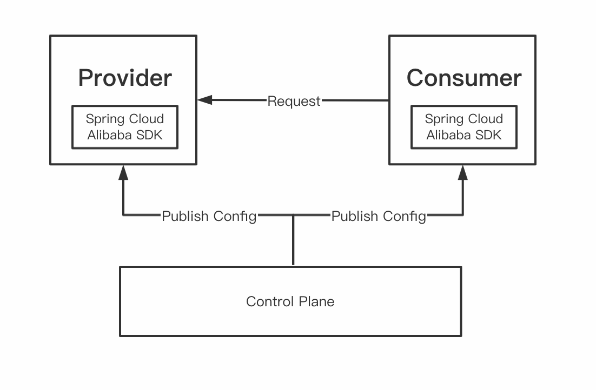
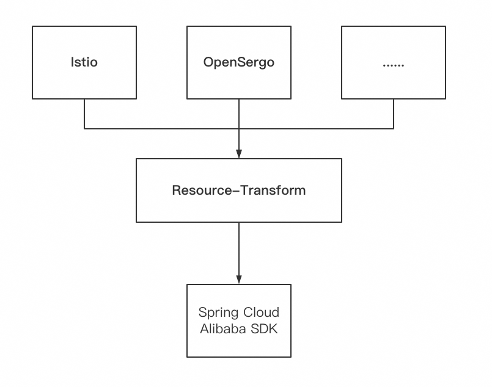
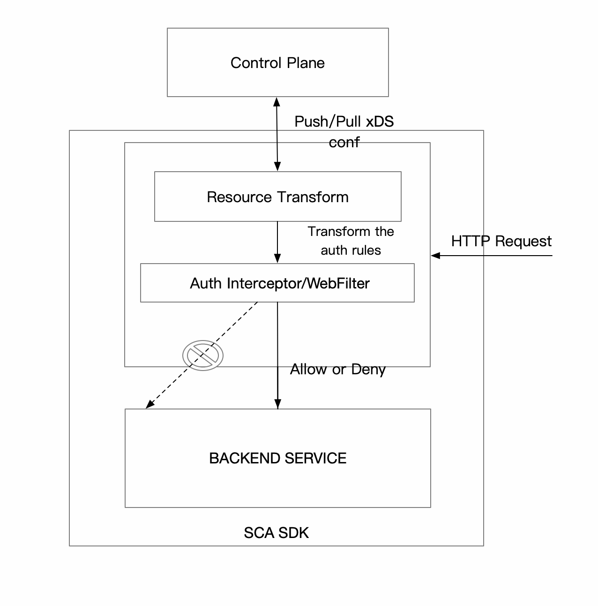

== Spring Cloud Alibaba Governance

Spring Cloud Alibaba Governance module is a micro-service governance sub-module launched by Spring Cloud Alibaba, which provides various types of micro-service governance capabilities, including label routing, service authentication, etc. Moreover, it supports various control planes, such as Istio and OpenSergo, so that users can get the governance rules in real time without modifying Spring Cloud applications, and apply these rules to Spring Cloud applications to govern the Spring Cloud application.

== How to use

=== Resource-Transform

The resource-transform module of Spring Cloud Alibaba Governance will uniformly transform the configurations published by different control planes, like Istio and OperSergo, into the unified abstract data structure of Spring Cloud Alibaba for subsequent use.

If you use Istio in your project to transform the configuration, you need to use a starter with a group ID of `com.alibaba.cloud` and an artifact ID of `spring-cloud-starter-alibaba-controlplane-istio`.
[source,xml,indent=0]
----
<dependency>
  <groupId>com.alibaba.cloud</groupId>
  <artifactId>spring-cloud-starter-alibaba-controlplane-istio</artifactId>
</dependency>
----

After that, configure the following configuration in the application.yml:

[source,yaml,indent=0]
----
server:
  port: ${SERVER_PORT:80}
spring:
  cloud:
    governance:
      auth:
        enabled: ${ISTIO_AUTH_ENABLE:true}
    istio:
      config:
        enabled: ${ISTIO_CONFIG_ENABLE:true}
        host: ${ISTIOD_ADDR:127.0.0.1}
        port: ${ISTIOD_PORT:15010}
        polling-pool-size: ${POLLING_POOL_SIZE:10}
        polling-time: ${POLLING_TIMEOUT:10}
        istiod-token: ${ISTIOD_TOKEN:}
        log-xds: ${LOG_XDS:true}
----

Here's an explanation of each field:
|===
|Configuration Item|key|Default Value|Description
|Whether to enable authentication| spring.cloud.governance.auth.enabled|true|
|Whether to connect to Istio to obtain authentication configuration| spring.cloud.istio.config.enabled|true|
|Host of Istiod| spring.cloud.istio.config.host|127.0.0.1|
|Port of Istiod| spring.cloud.istio.config.port|15012|15010 port does not need TLS，but 15012 does
|Thread pool size for SCA to pull the config| spring.cloud.istio.config.polling-pool-size|10|
|Time interval for SCA to pull the config| spring.cloud.istio.config.polling-time|30|The unit is second
|JWT token for SCA to connect to 15012 port| spring.cloud.istio.config.istiod-token|Content of file `/var/run/secrets/tokens/istio-token` in the pod of application|
|Whether to print logs about xDS| spring.cloud.istio.config.log-xds|true|
|===

### Run the application
You need to run the application in the K8s environment and inject some meta information about K8s into the following environment variables for the running application.

|===
|Environment variable name|K8s pod metadata name
|POD_NAME|metadata.name
|NAMESPACE_NAME|metadata.namespace
|===

=== Use Label Routing
With the introduction of the configuration transformation module, we can obtain the governance rules to give the Spring Cloud application some governance capabilities. Label routing module can route the Spring Cloud application according to the request header, request parameters and other tags to route to different services.

If you use Spring Cloud Alibaba Governance Label Routing in your project, You need to use a starter with a group ID of `com.alibaba.cloud` and an artifact ID of `spring-cloud-starter-alibaba-governance-routing`.
[source,xml,indent=0]
----
<dependency>
  <groupId>com.alibaba.cloud</groupId>
  <artifactId>spring-cloud-starter-alibaba-governance-routing</artifactId>
</dependency>
----

With the introduction of Istio Resource Transform module, the label routing module supports routing of the following types of request meta-information:

* Request Path
* Request Header
* Request Param

We use Istio to publish corresponding `DestinationRule` and `VirtualService` to configure corresponding labeled routing rules. For details, see the following documents and examples:

* https://istio.io/latest/zh/docs/reference/config/networking/virtual-service/#VirtualService
* https://istio.io/latest/zh/docs/concepts/traffic-management/#destination-rules
* spring-cloud-alibaba-examples/governance-example/label-routing-example/istio-label-routing-consumer-example

=== Use Authentication

With the introduction of the configuration transformation module, we can obtain the governance rules to give the Spring Cloud application some governance capabilities. The Authentication module provides various authentication modes for Spring Cloud applications, such as IP blacklist and whitelist and JWT authentication.

If you use Istio in your project to transform the configuration, you need to use a starter with a group ID of `com.alibaba.cloud` and an artifact ID of `spring-cloud-starter-alibaba-governance-auth`.

[source,xml,indent=0]
----
<dependency>
  <groupId>com.alibaba.cloud</groupId>
  <artifactId>spring-cloud-starter-alibaba-governance-auth</artifactId>
</dependency>
----

We use Istio to publish corresponding `AuthorizationPolicy` and `RequestAuthentication` to configure corresponding Authentication rules. For details, see the following documents and examples

* https://istio.io/latest/zh/docs/reference/config/security/request_authentication/
* https://istio.io/latest/zh/docs/reference/config/security/authorization-policy/
* spring-cloud-alibaba-examples/governance-example/authentication-example/istio-authentication-provider-mvc-example
* spring-cloud-alibaba-examples/governance-example/authentication-example/istio-authentication-provider-webflux-example