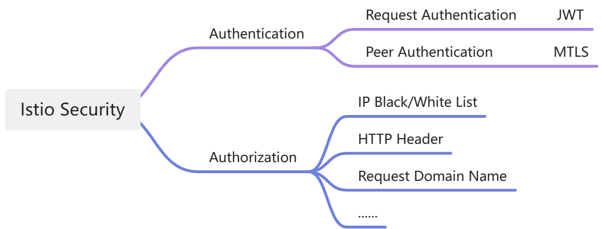

== Spring Cloud Alibaba Mtls

=== Zero Trust Security

==== Introduction

Zero Trust is an approach to designing security protection architectures that centers on the idea that, by default, all interactions are untrustworthy. This is in contrast to traditional architectures, which may judge trustworthiness based on whether or not the communication begins inside the firewall. Zero-trust architectures, on the other hand, eschew this implicit trust model and emphasize authentication and authorization at every interaction.

Specifically, zero trust seeks to bridge the gap between security protection architectures that rely on implicit trust models and one-time authentication. In a zero-trust architecture, all users, devices and applications are considered potential threats and require authentication and authorization, regardless of whether they are located on the internal network. Zero Trust implements identity-centric access control mechanisms and builds a security foundation based on a "continuous authentication + dynamic authorization" model.

==== How Istio achieves zero-trust security

As shown above, Istio offers two types of authentication:

（1）Request Authentication

Used for end-user authentication to verify the credential attached to the request. This type of authentication is used to verify the identity of end-users for finer-grained access control and authorization in services. Istio can integrate with a variety of user authentication mechanisms, such as JSON Web Token (JWT)-based authentication, OAuth 2.0, OpenID Connect, and more.

（2）Peer Authentication

Used for service-to-service authentication to verify the client making the connection. Uses the Transport Layer Security (TLS) protocol to provide encryption and authentication for communication between services. Each service has a unique service account and is authenticated using digital certificates. This authentication mechanism ensures that only authenticated services can communicate with each other, preventing unauthorized access to services.

Spring Cloud Alibaba has implemented RequestAuthentication and Authentication (refer to https://github.com/alibaba/spring-cloud-alibaba/blob/2.2.x/spring-cloud-alibaba-docs/src/main/asciidoc/governance.adoc[Spring Cloud Alibaba Governance] and https://github.com/alibaba/spring-cloud-alibaba/tree/2.2.x/spring-cloud-alibaba-examples/governance-example/authentication-example[Example: Spring Cloud Alibaba Authorization Examples]). This document therefore focuses on PeerAuthentication.

Istio offers mutual TLS as a full stack solution for PeerAuthentication, which includes:

1. Provides each service with a strong identity representing its role to enable interoperability across clusters and clouds, refer to https://istio.io/latest/docs/concepts/security/#istio-identity[Istio Identity]. On Kubernetes, workloads can be identified using Kubernetes Service Account;

2. Secures service-to-service communication;

3. Provides a key management system to automate key and certificate generation, distribution, and rotation, refer to https://istio.io/latest/docs/concepts/security/#pki[Identity and certificate management].

=== Spring Cloud Alibaba Mtls Module Introduction

Spring Cloud Alibaba Mtls focuses on service-to-service authentication. By adding the spring-cloud-starter-alibaba-governance-mtls module, you can implement mutual TLS capabilities for Spring Cloud Alibaba applications.

As shown in the figure below, the spring-cloud-starter-alibaba-governance-mtls module provides certificate management, traffic pattern switching, support for AuthorizationPolicy principals configuration, and the ability to use mutual TLS interactions for a variety of client/server implementations.

==== Certificate Management

===== Certificate Acquisition

First note that you need to build a Kubernetes cluster and deploy Istio in it, refer to https://istio.io/latest/docs/setup/install[Istio Installation]. Then add the following starter dependency to the application that needs to implement the mtls capability:

[source,xml,indent=0]
----
<dependency>
  <groupId>com.alibaba.cloud</groupId>
  <artifactId>spring-cloud-starter-xds-adapter</artifactId>
</dependency>
----

There are two ways to connect to the Istio control plane: direct connection and injection of pilot-agent, refer to https://github.com/alibaba/spring-cloud-alibaba/blob/2.2.x/spring-cloud-alibaba-docs/src/main/asciidoc/governance.adoc[Spring Cloud Alibaba Governance].

Add the following to the `application.yml` configuration file:

[source,yaml,indent=0]
----
spring:
  cloud:
    mtls:
      config:
        enabled: ${MTLS_ENABLE:true}
        server-tls: ${SERVER_TLS:true}
----

The meaning of the fields is as follows:
|===
|Configuration Item|key|Default Value
|Whether to enable mtls| spring.cloud.mtls.enabled|true
|Whether to start in tls traffic mode| spring.cloud.server-tls.enabled|true
|===

====== Connect to istio control plane directly

image::pic/connect-directly-to-Istiod.png[width=50%,align=center]

For Spring Cloud Alibaba applications in Proxyless mode, there is no need to use an envoy proxy. The Spring Cloud Alibaba SDK can directly play the role of an istio-agent, generating the private key for the application and requesting a certificate from the Istio control plane directly in the SDK.

To connect to port 15012 of the istio control plane when connecting directly to the istio control plane, you need to mount this application's Service Account as a projected volumn on the /var/run/secrets/tokens/istio-token path of k8s, as described at https://github.com/alibaba/spring-cloud-alibaba/blob/2.2.x/spring-cloud-alibaba-docs/src/main/asciidoc/governance.adoc[Spring Cloud Alibaba Governance].

====== Inject pilot-agent

As shown in the above figure, referring to the implementation of https://istio.io/latest/blog/2021/proxyless-grpc/[Istio / gRPC Proxyless Service Mesh], pilot-agent can be used as a unified proxy for the xDS protocol, after adding the `inject.istio.io/templates: grpc-agent` annotation, the Spring Cloud Alibaba application will fetch the bootstrap file generated by the pilot-agent, which will store the path of the certificate and the certificate expiration time.

===== Certificate Rotation

The spring-cloud-starter-alibaba-governance-mtls module will update the certificate periodically to ensure the validity of the certificate, and users do not need to do it manually.

==== Traffic Mode Switching

The Spring Cloud Alibaba Mtls module enables applications to dynamically switch between http/https modes via the Actuator endpoint. Add the following dependency to your application:

[source,xml,indent=0]
----
<dependency>
    <groupId>org.springframework.boot</groupId>
    <artifactId>spring-boot-starter-actuator</artifactId>
</dependency>
----

And configure the external exposure of the Actuator endpoint in `application.yml`:

[source,yaml,indent=0]
----
management:
  endpoints:
    web:
      exposure:
        include: "*"
----

Once configured, http/https mode switching can be achieved by consuming Actuator endpoints, refer to https://github.com/alibaba/spring-cloud-alibaba/tree/2.2.x/spring-cloud-alibaba-examples/mtls-example[Spring Cloud Alibaba Mtls Examples].

==== AuthorizationPolicy

Istio enforces access control on server-side inbound traffic through authorization policies, refer to https://istio.io/latest/docs/concepts/security/#authorization-policies[authorization-policies]。

The spring-cloud-starter-alibaba-governance-auth module provides a variety of authentication capabilities for the application, see the reference at https://github.com/alibaba/spring-cloud-alibaba/blob/2.2.x/spring-cloud-alibaba-docs/src/main/asciidoc/governance.adoc[Spring Cloud Alibaba Governance]. To use the Spring Cloud Alibaba service authentication feature, you need to add the following dependency:

[source,xml,indent=0]
----
<dependency>
  <groupId>com.alibaba.cloud</groupId>
  <artifactId>spring-cloud-starter-alibaba-governance-auth</artifactId>
</dependency>
----

And enable authentication in `application.yml`:

[source,yaml,indent=0]
----
spring:
  cloud:
    governance:
      auth:
        enabled: ${ISTIO_AUTH_ENABLE:true}
----

After ensuring that the spring-cloud-starter-alibaba-governance-mtls module has been introduced and TLS traffic mode have been enabled, you can then apply specific authorization policy configurations on the pod where the Spring Cloud Alibaba application resides, refer to https://istio.io/latest/docs/reference/config/security/authorization-policy/[istio / authorization-policy] and https://github.com/alibaba/spring-cloud-alibaba/tree/2.2.x/spring-cloud-alibaba-examples/mtls-example[Spring Cloud Alibaba Mtls Examples].

==== Framework Adaptation

===== Server

Provides automatic loading and hot updating of istio certificates for Spring MVC (tomcat), and Spring Webflux (Netty).

===== Client

For client implementations such as feign, resttemplate, etc., ssl contexts with hot update capability are provided, and istio certificate updates can be performed automatically after user configuration.

Specific examples can be found in https://github.com/alibaba/spring-cloud-alibaba/tree/2.2.x/spring-cloud-alibaba-examples/mtls-example[Spring Cloud Alibaba Mtls Examples].