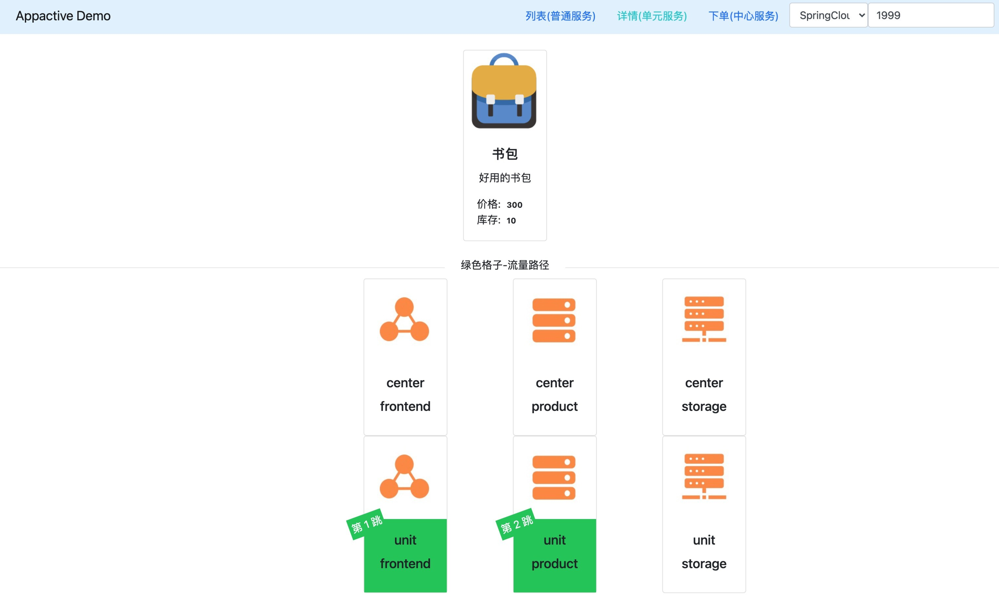
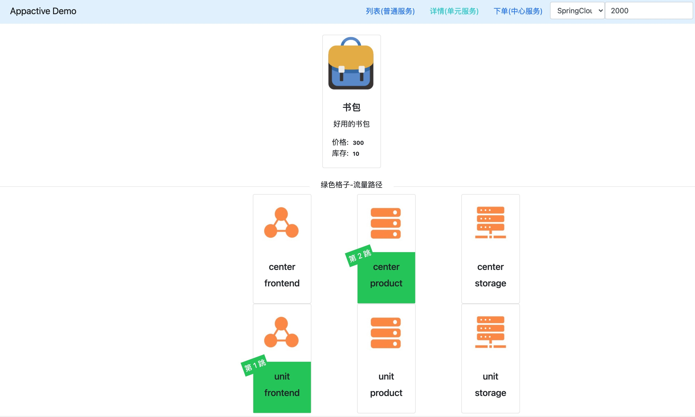
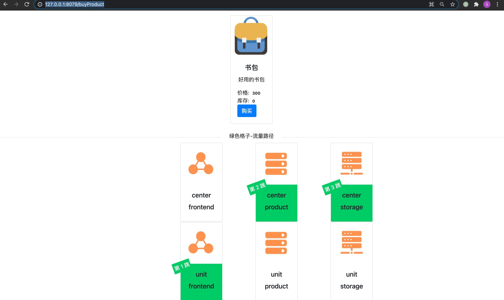

# AppActive Example

## 项目说明


本 demo 整体架构如上图： 

注：

- 应用共同依赖的注册中心 Nacos 和 数据库 MySQL 未在图中展示出来。
- 本 demo 的命令通道依赖于 Nacos。

### 核心概念

异地多活的思想类比于日常中的鸡蛋不要放在一个篮子里面，通过对业务应用进行单元化拆分部署，使得一个单元的故障影响面限定在特定单元内。在基于 AppActive 做应用多活方案中，可根据应用属性将应用分为全局、核心和一般服务 3 类，其又可归属到中心单元和普通单元 2 类单元中，单元一般用来指代机房。

3 类服务：
- 全局服务：强一致性的服务（例如库存、金额等），无法做异地多活单元化拆分，其需要在中心单元进行服务读写。
- 核心服务：做单元化拆分的业务应用，根据预设的多活规则，根据请求信息在特定单元进行读写的业务，核心业务的拆分是异地多活系统建设中的核心。
- 普通服务：属于系统非核心链路上的业务，对数据一致性要求较低的应用，一般出于成本考虑不做单元化拆分。


2 类单元：

- 中心单元：中心单元，也可称为中心机房，可承载全局、核心和普通服务 3 类，其一般在机房硬件配置上较一般单元高。
- 一般单元：其他非中心单元的单元，用来承载非全局服务以外的其他服务，也可称为一般机房。


本 example 中共有 3 个应用，按照距离（调用链路）终端用户由近及远分别为：

- frontend: 前端应用，接受用户请求，请求到实际数据后返回
- product: 产品应用，提供三个服务：
	- 产品列表: 普通服务
	- 产品详情: 核心服务
	- 产品下单: 全局服务
- storage: 库存应用，供下单服务扣减库存

应用在中心单元（Center）和 普通单元（Unit） 各部署一套（对等部署）。

图中绿色格子代表了本次请求的调用链路。

## 示例

### 快速接入
在启动示例进行演示之前，我们先了解一下 Spring Cloud 应用如何使用 AppActive 所提供的异地多活能力。
**注意 本章节只是为了便于您理解接入方式，本示例代码中已经完成接入工作，您无需再进行修改。**

1. 首先，修改 pom.xml 文件，在 provider 和 consumer 已添加最新 `spring-cloud-alibaba-dependencies` 的基础上添加以下 maven 依赖。

       <dependency>
            <groupId>com.alibaba.cloud</groupId>
            <artifactId>spring-cloud-starter-alibaba-appactive</artifactId>
        </dependency>

2. 在 Provider 应用的 `application.properties` 配置文件中给特定接口配置分流策略。其中后缀 `core-path` 用于配置核心服务，`global-path` 用于配置全局服务，`general-path` 用于配置一般服务，比如 demo 中的 product 应用分流策略配置如下：

        spring.cloud.appactive.filter.core-path=/detailHidden/*,/detail/*
        spring.cloud.appactive.filter.global-path=/buy/*
        spring.cloud.appactive.filter.general-path=/*

3. 在 Consumer 应用的 `application.properties` 配置客户端负载均衡为 AppActive 所提供的负载均衡算法，配置方式如下，注意需要将`[service-name]`替换成具体的待消费服务名。

        [service-name].ribbon.NFLoadBalancerRuleClassName =com.alibaba.cloud.appactive.consumer.AppactiveRule


### 快速启动

1. 启动 Nacos, MySQL, 并往 Nacos 中推送多活规则：
   
   - 在 `appactive-example` 目录下，执行：`docker-compose -f component-quickstart.yml up -d` 启动 Nacos, MySQL。 
   - 执行以下命令：`curl -X POST 'http://127.0.0.1:8848/nacos/v1/console/namespaces' -d 'customNamespaceId=appactiveDemoNamespaceId&namespaceName=appactiveDemoNamespaceName&namespaceDesc=appactiveDemoNamespaceDesc'` 在 Nacos 配置中心中创建一个演示用命名空间 appactiveDemoNamespaceId。 
   - 执行以下命令：`sh baseline.sh 2 NACOS appactiveDemoNamespaceId`，往命名空间中推送多活规则。多活规则说明如下：
      - `appactive.dataId.idSourceRulePath`: 描述如何从 http 流量中提取路由标
      - `appactive.dataId.transformerRulePath`: 描述如何解析路由标
      - `appactive.dataId.trafficRouteRulePath`: 描述路由标和单元的映射关系
      - `appactive.dataId.dataScopeRuleDirectoryPath_mysql-product`: 描述数据库的属性

   
2. 启动 5 套应用，启动参数分别为：

- frontend
    ```
    -Dappactive.channelTypeEnum=NACOS
    -Dappactive.namespaceId=appactiveDemoNamespaceId
    -Dappactive.unit=unit
    -Dappactive.app=frontend
    -Dio.appactive.demo.unitlist=center,unit
    -Dio.appactive.demo.applist=frontend,product,storage
    -Dserver.port=8875
    ```
- product
    ```
    -Dappactive.channelTypeEnum=NACOS
    -Dappactive.namespaceId=appactiveDemoNamespaceId
    -Dappactive.unit=center
    -Dappactive.app=product
    -Dspring.datasource.url=jdbc:mysql://127.0.0.1:3306/product?characterEncoding=utf8&useSSL=false&serverTimezone=GMT&activeInstanceId=mysql&activeDbName=product
    -Dserver.port=8883
    ```
    ```
    -Dappactive.channelTypeEnum=NACOS
    -Dappactive.namespaceId=appactiveDemoNamespaceId
    -Dappactive.unit=unit
    -Dappactive.app=product
    -Dspring.datasource.url=jdbc:mysql://127.0.0.1:3306/product?characterEncoding=utf8&useSSL=false&serverTimezone=GMT&activeInstanceId=mysql&activeDbName=product
    -Dserver.port=8873
    ```
- storage
    ```
    -Dappactive.channelTypeEnum=NACOS
    -Dappactive.namespaceId=appactiveDemoNamespaceId
    -Dappactive.unit=center
    -Dappactive.app=storage
    -Dspring.datasource.url=jdbc:mysql://127.0.0.1:3306/product?characterEncoding=utf8&useSSL=false&serverTimezone=GMT
    -Dserver.port=8881
    ```
    ```
    -Dappactive.channelTypeEnum=NACOS
    -Dappactive.namespaceId=appactiveDemoNamespaceId
    -Dappactive.unit=unit
    -Dappactive.app=storage
    -Dspring.datasource.url=jdbc:mysql://127.0.0.1:3306/product?characterEncoding=utf8&useSSL=false&serverTimezone=GMT
    -Dserver.port=8871
    ```

## 效果演示

1. 归属于一般（Unit）单元的普通应用服务调用演示。在浏览器中输入：`http://127.0.0.1:8079/listProduct` 地址，可见请求通过 frontend 应用被发送给了 product。

   

    由于上述路径中的 `/listProduct` 在 product 应用中匹配到的是 `/*` 路径规则，根据规则内容，该服务属于普通应用做了未做单元化拆分，所以frontend 在从注册中心获取的 product 地址列表中不存在倾向性，会随机选择地址进行请求发送。因此多次请求上述路径，会看到请求在 product 的一般（Unit)和 中心（center）单元应用中来回切换。

2. 归属于 unit 单元的核心应用服务调用演示。在浏览器中输入：`http://127.0.0.1:8079/detailProduct` 路径，由于上述路径中的 `/detailProduct` 在 product 应用中匹配到的是 `/detail/*` 路径规则，根据规则内容，该服务属于核心应用做了单元会拆分，其会根据请求中 Header, Cookie 或请求参数中的变量具体的值去判断该请求的下游单元类型，由于事先配置如下切流规则（具体可见 rule 目录下的 idUnitMapping.json 文件内容）：
    ```
    {
      "itemType": "UnitRuleItem",
      "items": [
        {
          "name": "unit",
          "conditions": [
            {
              "@userIdBetween": [
                "0~1999"
              ]
            }
          ]
        },
        {
          "name": "center",
          "conditions": [
            {
              "@userIdBetween": [
                "2000~9999"
              ]
            }
          ]
        }
      ]
    }
    ```
    上述规则表示，用户Id为 0 ~ 1999 的请求将发送给下游提供者中的一般（Unit）单元中的核心应用实例，用户Id为 2000 ~ 9999 的请求将发送给下游提供者中的中心（Center）单元全局应用实例。
    如下图，模拟一个用户Id为 1999 的请求，可见请求通过 frontend 发送到了下游中 product 的一般（Unit）单元中的核心应用实例。

   

    如下图，模拟一个用户Id为 2000 的请求，可见请求通过 frontend 发送到了下游中 product 的中心（center）单元中的全局应用实例。

   

3. 归属于中心（Center）单元的全局应用服务调用演示。在浏览器中输入：`http://127.0.0.1:8079/buyProduct` 路径，由于上述路径中的 `/buyProduct` 在 product 和 storage 应用中匹配到的是 `/buy/*` 路径规则，根据规则内容，该服务属于全局应用未做单元会拆分，其会直接将请求发送到下游的中心（Center）单元中全局应用实例。

   

4. 切流演示。切流时主要做了如下几件事：
    - 构建新的映射关系规则和禁写规则（手动）
    - 将禁写规则推送给应用
    - 等待数据追平后将新的映射关系规则推送给应用
   接下来演示的切流规则，会将用户Id为 0 ~ 2999 的请求将发送给下游提供者中的一般（Unit）单元中的核心应用实例，用户Id为 3000 ~ 9999 的请求将发送给下游提供者中的中心（Center）单元中的全局应用实例。具体的规则详情见 idUnitMappingNext.json：
        ```
        {
          "itemType": "UnitRuleItem",
          "items": [
            {
              "name": "unit",
              "conditions": [
                {
                  "@userIdBetween": [
                    "0~2999"
                  ]
                }
              ]
            },
            {
              "name": "center",
              "conditions": [
                {
                  "@userIdBetween": [
                    "3000~9999"
                  ]
                }
              ]
            }
          ]
        }
        ```
        如下图，模拟一个用户Id为 2999 的请求，可见请求通过 frontend 发送到了下游中 product 的 unit 单元中的核心应用实例，切流规则生效。
        

        如下图，模拟一个用户Id为 3000 的请求，可见请求通过 frontend 发送到了下游中 product 的 center 单元中的全局应用实例，切流规则生效。
        


