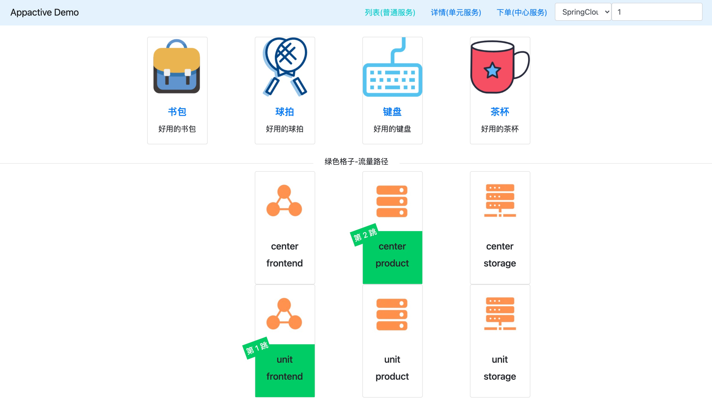
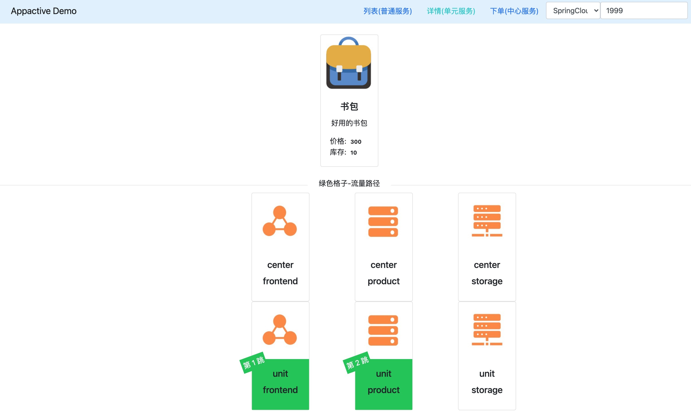
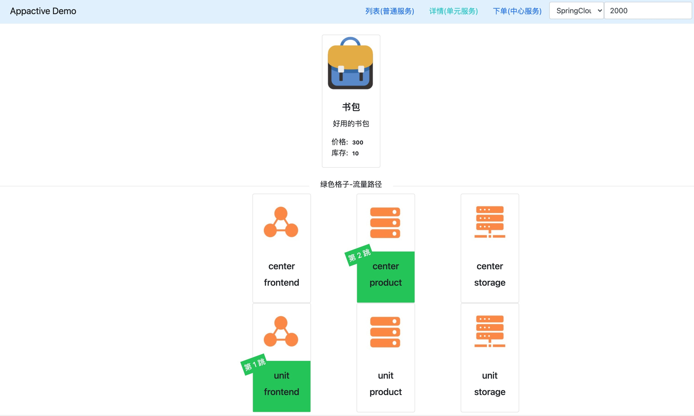

# AppActive Example

## Introduction



The overall structure of this demo is shown above.

Note: 

- The registry Nacos and database MySQL that the application depends on are not shown in the figure.
- The demo uses Nacos as a command channel

### Core Concept

concept

The idea of multi-activity in different places is analogous to that eggs in daily life should not be placed in one basket. By splitting and deploying business applications in units, the impact of a unit's failure is limited to a specific unit. In the application multi-activity scheme based on AppActive, service can be divided into three categories: global service, core service and general service, which can be classified into two types of units: center unit and normal unit. Units are generally used to refer to server room.

3 types service:
- Global service: business applications (such as inventory, amount, etc.) with strong consistency cannot be split between multiple activities in different places, and they need to read and write services in the center unit.
- Core service: an application that is divided into units, an application that reads and writes in a specific unit according to the preset multi-active rules and request information.
- General service: It belongs to the business on the non-core link of the system, has low requirements on data consistency, and is not divided into units.

2 types units:

- Center unit: also known as the center server room, can carry three types of global, core and general services, and generally has higher hardware configuration than the normal unit in the server room.
- Normal unit: other non-central units, used to carry services other than non-global services, can also be called general server rooms.

There are three applications in demo, according to the distance (call link) of the end user from near and far:

- frontend: frontend application, accept user requests, and return after requesting actual data.
- product: product application, providing three services:
    - product list: general service
    - product details: core service
    - product order: global service, relying on inventory application
- storage: storage application, it provides create orders service for users.

The applications are deployed in each of the center and normal unit.

The green grid in the figure represents the call link of the request.

## Instructions for use

### Quick start
Before starting the example for demonstration, let's take a look at how Spring Cloud applications use the remote multi-active capabilities provided by AppActive.
**Note, this chapter is only for your understanding of the access method. The access work has been completed in these examples, and you do not need to modify it.**

1. First, modify the pom.xml file to add the following maven dependencies based on the latest `spring-cloud-alibaba-dependencies` added to the provider and consumer.

       <dependency>
            <groupId>com.alibaba.cloud</groupId>
            <artifactId>spring-cloud-starter-alibaba-appactive</artifactId>
        </dependency>

2. Configure offload policies for specific interfaces in the `application.properties` configuration file of the Provider application. The suffix `core-path` is used to configure core services, `global-path` is used to configure global services, and `general-path` is used to configure general services. For example, the product application distribution strategy in the demo is configured as follows

        spring.cloud.appactive.filter.core-path=/detailHidden/*,/detail/*
        spring.cloud.appactive.filter.global-path=/buy/*
        spring.cloud.appactive.filter.general-path=/*

3. In the `application.properties` of the Consumer application, configure the client load balancing as the load balancing algorithm provided by AppActive. The configuration method is as follows. Note that `[service-name]` needs to be replaced with the specific service name to be consumed.

        [service-name].ribbon.NFLoadBalancerRuleClassName =com.alibaba.cloud.appactive.consumer.AppactiveRule


### Presentation preparation

1. Start Nacos, MySQL, and push multi-active rules to Nacos:
   
   - In the `appactive-example` directory, execute: `docker-compose -f component-quickstart.yml up -d` to start Nacos, MySQL.
   - Execute the following command: `curl -X POST 'http://127.0.0.1:8848/nacos/v1/console/namespaces' -d 'customNamespaceId=appactiveDemoNamespaceId&namespaceName=appactiveDemoNamespaceName&namespaceDesc=appactiveDemoNamespaceDesc'` Create a demo named in Nacos configuration center Space appactiveDemoNamespaceId.
   - Execute the following command: `sh baseline.sh 2 NACOS appactiveDemoNamespaceId` to push the multi-active rule to the namespace. The multi-live rules are described as follows:
      - `appactive.dataId.idSourceRulePath`: Describes how to extract routing tokens from http traffic
      - `appactive.dataId.transformerRulePath`: Describes how to parse routing tokens
      - `appactive.dataId.trafficRouteRulePath`: Describes the mapping between routing labels and units
      - `appactive.dataId.dataScopeRuleDirectoryPath_mysql-product`: Properties that describe the database

   
2. Start five sets of applications, the startup parameters are:

- frontend
    ```
    -Dappactive.channelTypeEnum=NACOS
    -Dappactive.namespaceId=appactiveDemoNamespaceId
    -Dappactive.unit=unit
    -Dappactive.app=frontend
    -Dio.appactive.demo.unitlist=center,unit
    -Dio.appactive.demo.applist=frontend,product,storage
    -Dserver.port=8875
    ```
- product
    ```
    -Dappactive.channelTypeEnum=NACOS
    -Dappactive.namespaceId=appactiveDemoNamespaceId
    -Dappactive.unit=center
    -Dappactive.app=product
    -Dspring.datasource.url=jdbc:mysql://127.0.0.1:3306/product?characterEncoding=utf8&useSSL=false&serverTimezone=GMT&activeInstanceId=mysql&activeDbName=product
    -Dserver.port=8883
    ```
    ```
    -Dappactive.channelTypeEnum=NACOS
    -Dappactive.namespaceId=appactiveDemoNamespaceId
    -Dappactive.unit=unit
    -Dappactive.app=product
    -Dspring.datasource.url=jdbc:mysql://127.0.0.1:3306/product?characterEncoding=utf8&useSSL=false&serverTimezone=GMT&activeInstanceId=mysql&activeDbName=product
    -Dserver.port=8873
    ```
- storage
    ```
    -Dappactive.channelTypeEnum=NACOS
    -Dappactive.namespaceId=appactiveDemoNamespaceId
    -Dappactive.unit=center
    -Dappactive.app=storage
    -Dspring.datasource.url=jdbc:mysql://127.0.0.1:3306/product?characterEncoding=utf8&useSSL=false&serverTimezone=GMT
    -Dserver.port=8881
    ```
    ```
    -Dappactive.channelTypeEnum=NACOS
    -Dappactive.namespaceId=appactiveDemoNamespaceId
    -Dappactive.unit=unit
    -Dappactive.app=storage
    -Dspring.datasource.url=jdbc:mysql://127.0.0.1:3306/product?characterEncoding=utf8&useSSL=false&serverTimezone=GMT
    -Dserver.port=8871
    ```

## Demonstration process

1. Demonstration of general service calls belonging to the normal unit. Typing: `http://127.0.0.1:8079/listProduct` address in the browser, it can be seen that the request is sent to the product through the frontend application.

   

    Since `/listProduct` in the above path matches the `/*` path rule in the product application, which corresponds to the normal unit, frontend does not have a tendency in the product address list obtained from the registry, and will randomly select an address for request sending. So requesting the above path multiple times will see the request switch back and forth between the normal and center units of the product.

2. Demonstration of core service calls belonging to the different unit by request information. Typing: `http://127.0.0.1:8079/detailProduct` in the browser, because the `/detailProduct` in the above path matches the `/detail/*` path rule in the product application, corresponding to the normal(unit) unit, it will be based on the request The specific value of the variable in the Header, Cookie or request parameter is used to determine the downstream unit type of the request, because the following flow switching rules are configured in advance (for details, see the content of the idUnitMapping.json file in the rule directory):
    ```
    {
      "itemType": "UnitRuleItem",
      "items": [
        {
          "name": "unit",
          "conditions": [
            {
              "@userIdBetween": [
                "0~1999"
              ]
            }
          ]
        },
        {
          "name": "center",
          "conditions": [
            {
              "@userIdBetween": [
                "2000~9999"
              ]
            }
          ]
        }
      ]
    }
    ```
    The above rules mean that requests with user IDs of 0 ~ 1999 will be sent to the noraml(unit) in the downstream provider, and requests with user IDs of 2000 ~ 9999 will be sent to the center unit of the downstream provider.
    As shown in the figure below, a request with a user ID of 1999 is simulated. It can be seen that the request is sent to the normal unit of product in the downstream through the frontend.

   

    As shown in the figure below, a request with a user ID of 2000 is simulated. It can be seen that the request is sent to the center unit node of the product in the downstream through the frontend.

   

3. Demonstration of global service invocation belonging to the center unit. Typing: `http://127.0.0.1:8079/buyProduct` path in the browser, because the `/buyProduct` in the above path matches the `/buy/*` path rule in the product and storage applications, corresponding to the center unit, it will directly send the request to the downstream center unit node.

   

4. Cut flow demo. The main things to do when cutting flow are as follows:
    - Build new mapping relationship rules and write prohibition rules (manually).
    - Push the write prohibition rules to the application.
    - Push the new mapping relationship rules to the application after waiting for the data to equalize.
   The streaming rule demonstrated next will send requests with user IDs 0 ~ 2999 to the normal(called unit) unit in the downstream provider, and requests with user IDs 3000 ~ 9999 will be sent to the center(called center) unit in the downstream provider. For specific rules, see idUnitMappingNext.json:
        ```
        {
          "itemType": "UnitRuleItem",
          "items": [
            {
              "name": "unit",
              "conditions": [
                {
                  "@userIdBetween": [
                    "0~2999"
                  ]
                }
              ]
            },
            {
              "name": "center",
              "conditions": [
                {
                  "@userIdBetween": [
                    "3000~9999"
                  ]
                }
              ]
            }
          ]
        }
        ```
        As shown in the figure below, a request with a user ID of 2999 is simulated. It can be seen that the request is sent to the unit node of the product in the downstream through the frontend, and the flow switching rule takes effect.
        

        As shown in the figure below, a request with a user ID of 3000 is simulated. It can be seen that the request is sent to the center unit node of the product in the downstream through the frontend, and the cut flow rule takes effect.
        


