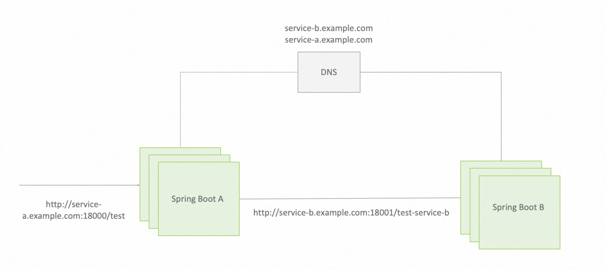

# Spring Boot 单体应用升级 Spring Cloud 微服务

## 原始 Spring Boot 应用架构
在示例中，我们有如下基于 Spring Boot 开发的应用架构，[查看完整示例源码](./spring-boot-sample)：

我们这里列出来的只是一种示例架构。基于 Spring Boot 构建的应用架构变化多样，比如可能如下一些常用的架构，但不论哪种架构，升级 Spring Cloud 的大致改造方式都是类似的（都可以转为基于 Nacos 注册中心的地址发现与负载均衡）。
* 基于 DNS 自定义域名，服务间的通过域名调用实现负载均衡
* 基于 SLB 的中心化流量转发，调用直接转发到 SLB，由 SLB 实现在服务间实现流量转发
* 基于 Kubernetes Service 微服务体系，依赖 Kubernetes ClusterIP 等实现负载均衡与调用转发

## 升级后的 Spring Cloud Alibaba 应用架构
我们将以上示例全部改造为 Spring Cloud 应用，改造后的架构如下，[查看完整示例源码](./spring-cloud-sample)：

新架构基于 Spring Cloud Service Discovery 机制实现地址自动发现与负载均衡，使用 Nacos 作为注册中心。
