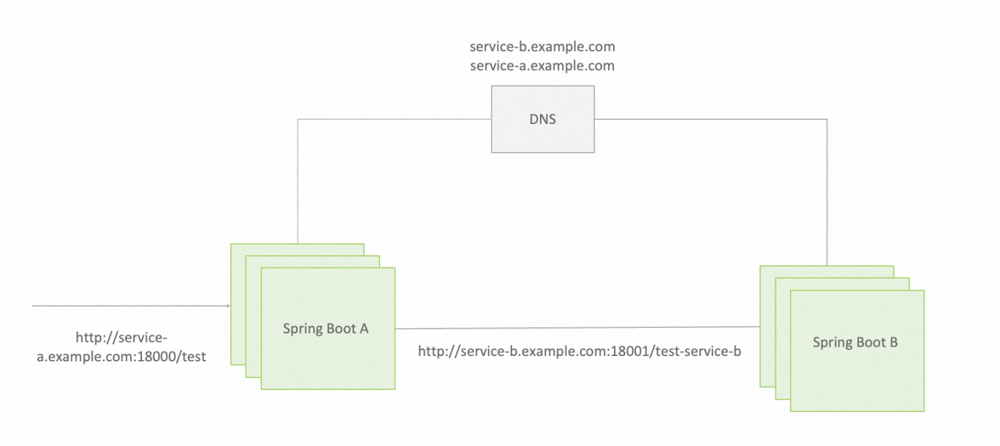

# 示例 Spring Boot 应用
示例包含 spring-boot-A（service-a） 和 spring-boot-B（service-b）两个应用（微服务），应用之间依赖 dns 域名完成互相调用。



因此，要完整的运行示例，我们首先需要在本地 `/etc/hosts` 配置域名映射：
```
127.0.0.1 service-b.example.com
127.0.0.1 service-a.example.com
```

依次启动 spring-boot-B（service-b）、spring-boot-A（service-a） 应用，使用以下命令验证应用正常工作：

```shell
$ curl http://service-a.example.com:18000/test
Get result from service B.
```

