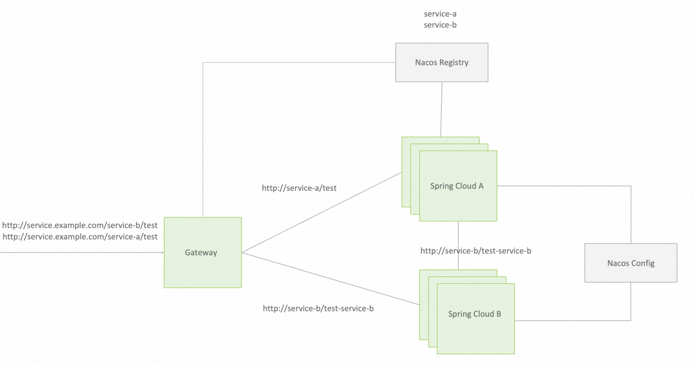

# 示例 Spring Cloud 应用

接下来，我们分步骤将 Spring Boot A 应用和 Spring Boot B 应用改造为 Spring Cloud 应用。

## 改造应用B
首先将 Spring Boot B 应用进行改造，接入 Spring Cloud Nacos Registry

### 第一步：添加依赖
```xml
<properties>
    <spring-cloud-alibaba.version>2022.0.0.0</spring-cloud-alibaba.version>
    <spring-cloud.version>2022.0.0</spring-cloud.version>
</properties>
<dependencyManagement>
    <dependencies>
        <dependency>
            <groupId>org.springframework.cloud</groupId>
            <artifactId>spring-cloud-dependencies</artifactId>
            <version>${spring-cloud.version}</version>
            <type>pom</type>
            <scope>import</scope>
        </dependency>
        <dependency>
            <groupId>com.alibaba.cloud</groupId>
            <artifactId>spring-cloud-alibaba-dependencies</artifactId>
            <version>${spring-cloud-alibaba.version}</version>
            <type>pom</type>
            <scope>import</scope>
        </dependency>
    </dependencies>
</dependencyManagement>
<dependencies>
    <!-- Nacos 服务发现 -->
    <dependency>
        <groupId>com.alibaba.cloud</groupId>
        <artifactId>spring-cloud-starter-alibaba-nacos-discovery</artifactId>
    </dependency>
    <!-- 服务发现：OpenFeign服务调用 -->
    <dependency>
        <groupId>org.springframework.cloud</groupId>
        <artifactId>spring-cloud-starter-openfeign</artifactId>
    </dependency>
  <!-- 服务发现：OpenFeign服务调用 -->
    <dependency>
        <groupId>org.springframework.cloud</groupId>
        <artifactId>spring-cloud-starter-loadbalancer</artifactId>
    </dependency>
</dependencies>
```
### 第二步：完善配置文件
```yaml
spring:
  application:
    name: spring-cloud-b #项目名称必填，在注册中心唯一；最好和之前域名保持一致，第四步会讲到原因
  cloud:
    nacos:
      discovery: #启用 spring cloud nacos discovery
        server-addr: 127.0.0.1:8848
```
### 第三步：启动类注解
```java
@SpringBootApplication
@EnableDiscoveryClient
public class SpringBootAApplication {
    public static void main(String[] args) {
        SpringApplication.run(ProviderApplication.class, args);
    }
}
```
## 改造应用A
### 第一步：添加依赖
```xml
<properties>
    <spring-cloud-alibaba.version>2022.0.0.0</spring-cloud-alibaba.version>
    <spring-cloud.version>2022.0.0</spring-cloud.version>
</properties>
<dependencyManagement>
    <dependencies>
        <dependency>
            <groupId>org.springframework.cloud</groupId>
            <artifactId>spring-cloud-dependencies</artifactId>
            <version>${spring-cloud.version}</version>
            <type>pom</type>
            <scope>import</scope>
        </dependency>
        <dependency>
            <groupId>com.alibaba.cloud</groupId>
            <artifactId>spring-cloud-alibaba-dependencies</artifactId>
            <version>${spring-cloud-alibaba.version}</version>
            <type>pom</type>
            <scope>import</scope>
        </dependency>
    </dependencies>
</dependencyManagement>
<dependencies>
    <!-- Nacos 服务发现 -->
    <dependency>
        <groupId>com.alibaba.cloud</groupId>
        <artifactId>spring-cloud-starter-alibaba-nacos-discovery</artifactId>
    </dependency>
    <!-- 服务发现：OpenFeign服务调用 -->
    <dependency>
        <groupId>org.springframework.cloud</groupId>
        <artifactId>spring-cloud-starter-openfeign</artifactId>
    </dependency>
  <!-- 服务发现：负载均衡 -->
    <dependency>
        <groupId>org.springframework.cloud</groupId>
        <artifactId>spring-cloud-starter-loadbalancer</artifactId>
    </dependency>
</dependencies>
```
### 第二步：配置文件
```yaml
spring:
  application:
    name: spring-cloud-a #项目名称必填，在注册中心唯一；最好和之前域名保持一致，第四步会讲到原因
  cloud:
    nacos:
      discovery: #启用 spring cloud nacos discovery
        server-addr: 127.0.0.1:8848
```
### 第三步：启动类注解
```java
@SpringBootApplication
@EnableDiscoveryClient
@EnableFeignClients
public class SpringBootAApplication {
    public static void main(String[] args) {
        SpringApplication.run(ProviderApplication.class, args);
    }
}
```
### 第四步：调整调用方式
改造后的应用我们要使用 Nacos 注册中心来做地址发现，并使用 Loadbalancer 来实现负载均衡。
```java
@Bean
@LoadBalanced
public RestTemplate restTemplate() {
    return new RestTemplate();
}
```

```java
@RestController
 public class TestController {

    @Autowired
    private RestTemplate restTemplate;

    @GetMapping(value = "/echo-rest/{str}")
    public String rest(@PathVariable String str) {
        return restTemplate.getForObject("http://service-provider/echo/" + str, String.class);
    }
}
```
## 增加 Gateway 网关
### 依赖
```xml
<properties>
    <spring-cloud-alibaba.version>2022.0.0.0</spring-cloud-alibaba.version>
    <spring-cloud.version>2022.0.0</spring-cloud.version>
</properties>
<dependencies>
    <dependency>
        <groupId>org.springframework.cloud</groupId>
        <artifactId>spring-cloud-starter-gateway</artifactId>
    </dependency>
    <!-- Nacos 服务发现 -->
    <dependency>
        <groupId>com.alibaba.cloud</groupId>
        <artifactId>spring-cloud-starter-alibaba-nacos-discovery</artifactId>
    </dependency>
    <!-- 服务发现：OpenFeign服务调用 -->
    <dependency>
        <groupId>org.springframework.cloud</groupId>
        <artifactId>spring-cloud-starter-openfeign</artifactId>
    </dependency>
    <!-- 整合nacos需要添加负载均衡依赖 -->
    <dependency>
        <groupId>org.springframework.cloud</groupId>
        <artifactId>spring-cloud-starter-loadbalancer</artifactId>
    </dependency>
</dependencies>
<dependencyManagement>
    <dependencies>
        <dependency>
            <groupId>org.springframework.cloud</groupId>
            <artifactId>spring-cloud-dependencies</artifactId>
            <version>${spring-cloud.version}</version>
            <type>pom</type>
            <scope>import</scope>
        </dependency>
        <dependency>
            <groupId>com.alibaba.cloud</groupId>
            <artifactId>spring-cloud-alibaba-dependencies</artifactId>
            <version>${spring-cloud-alibaba.version}</version>
            <type>pom</type>
            <scope>import</scope>
        </dependency>
    </dependencies>
</dependencyManagement>
```

### 启动类注解
```java
@SpringBootApplication
@EnableDiscoveryClient
public class SpringGatewayApplication {
    public static void main(String[] args) {
        SpringApplication.run(SpringGatewayApplication.class, args);
    }
}
```

### 路由配置
```yaml
spring:
  cloud:
    gateway:
      # 路由数组：指当请求满足什么样的断言时，转发到哪个服务上
      routes:
        # 路由标识，要求唯一，名称任意
        - id: service-a
          # 请求最终被转发到的目标地址
          uri: http://service-a:18000
          # 设置断言
          predicates:
            - Path=/service-a/test/**
          filters:
            # StripPrefix：去除原始请求路径中的前1级路径，即/service-a
            - StripPrefix=1            
            
        - id: service-b
          # 请求最终被转发到的目标地址
          uri: http://service-b:18001
          # 设置断言
          predicates:
            - Path=/service-b/test-service-b/**
          filters:
            # StripPrefix：去除原始请求路径中的前1级路径，即/service-b
            - StripPrefix=1            

```

## 启动与验证
依次启动 A、B、Gateway 三个应用。
访问：http://service.example.com/service-a/test 可以看到，请求正常被转发到 service-a、service-b，并实现多实例地址自动发现、负载均衡。

## 完整示例源码
spring-boot-example
spring-cloud-example
