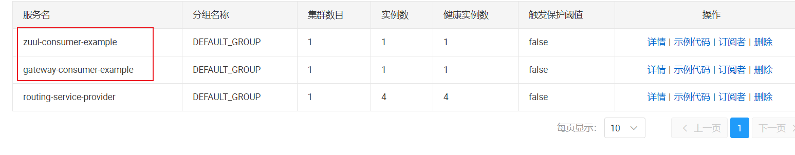

# Label Routing Docker-Compose Quickstart

本文章将会说明如何使用 Docker 来完成 Spring-Cloud-Alibaba (以下简称 SCA) 服务治理功能中标签路由功能的使用示例。

## 1. 环境准备

### 1.1 准备服务 Jar 包

1. 进入 `spring-cloud-alibaba\spring-cloud-alibaba-examples` 目录下，执行 `mvn clean package` 打包 example 服务 jar 包；

2. 进入 `spring-cloud-alibaba-examples/governance-example/docker-compose-example-quickstart/label-routing-quickstart` 目录下，执行以下脚本移动 jar 包到指定目录下；

   ```shell
   # linux/mac 直接执行
   ./move-example-jar.sh
   
   # windwos 下使用 githu bash 执行
   ,/move-example-jar.sh
   ```

3. 分别进入 `label-routing-gateway-consumer-example`  `label-routing-service-provider-example` `label-routing-webClient-consumer-example`（label-routing-quickstart 子级目录） 目录下查看 `app.jar` 是否存在。如果不存在手动移动即可；

4. 检查 `application-docker.yml` 配置文件是否准确。

### 1.2 安装 Docker

如果本机机器中没有 Docker 和 Docker-Compose 请参照如下链接进行安装

- Docker：https://docs.docker.com/engine/install/
- Docker-Compose：https://docs.docker.com/compose/install/

### 1.3 目录说明

```md
└─label-routing-quickstart
    │  .env													# Docker env 设置
    │  .gitignore							
    │  docker-compose-service-provider.yml					# 服务提供者和 nacos server
    │  docker-compose-gateway-consumer.yml					# 网关消费者 example
    │  docker-compose-web-client-consumer.yml				# 三种请求客户端消费者
    │  move-example-jar.sh									# 移动 jar 包脚本
    │  README.md											# 参考 README 文件
    │  README-zh.md
    |
    ├─assets
    │  └─img
    ├─label-routing-gateway-consumer-example
    │  │  DockerFile										# 启动服务消费者的 DockerFile 文件
    │  │
    │  ├─label-routing-gateway-consumer-example
    │  │      app.jar										# spring boot 应用 jar 包
    │  │      application-docker.yml						# spring boot 应用在 docker 容器中启动时的配置文件
    │  │
    │  └─label-routing-zuul-consumer-example
    │          app.jar
    │          application-docker.yml
    │
    ├─label-routing-service-provider-example				# 服务提供者文件夹
    │      app.jar
    │      application-dockerA1.properties
    │      application-dockerA2.properties
    │      application-dockerA3.properties
    │      application-dockerA4.properties
    │      DockerFile
    │      start-label-routing-service-provider.sh			# 服务提供者启动脚本（docker内）
    │
    └─label-routing-web-client-consumer-example				# 三种请求客户端消费者文件夹
        │  DockerFile
        │
        ├─label-routing-feign-consumer-example
        │      app.jar
        │      application-docker.yml
        │
        ├─label-routing-reactive-consumer-example
        │      app.jar
        │      application-docker.yml
        │
        └─label-routing-rest-consumer-example
                app.jar
                application-docker.yml
```


### 1.4 Postman 测试脚本

1. 进入 `spring-cloud-alibaba-examples/governance-example/label-routing-example/gateway-consumer-example/resources` 文件夹下，将网关消费者请求脚本导入 postman 中；
2. 进入 `spring-cloud-alibaba-examples/governance-example/label-routing-example/web-client-consumer-example/resources` 文件夹下，将客户端消费者请求脚本导入 postman 中。


## 2. 启动服务提供者和 nacos server

1. 进入 `spring-cloud-alibaba-examples/governance-example/docker-compose-example-quickstart/label-routing-quickstart` 文件夹下，在 terminal 中输入以下命令以启动 label-routing-service-provider-example 和 nacos-server；

   ```shell
   # 构建 docker 镜像
   docker-compose -f docker-compose-service-provider.yml build
   
   # 启动 docker 容器
   docker-compose -f docker-compose-service-provider.yml up -d 
   
   # 可以去掉最后的 -d 参数，查看服务启动过程中的日志输出
   docker-compose -f docker-compose-service-provider.yml up
   ```

   

2. 间隔一段时间之后（需要等待 docker 容器启动完成）本地机器访问 nacos 的控制台地址 (http://127.0.0.1:8848/nacos) 查看已经注册上线的 service-provider，其中包含四个服务实例。

   

   

   

3. 如果出现以上服务注册信息，即证明 docker 容器启动成功！点击详情可以看到服务提供者实例的元数据信息。

   

   

   

## 3. 客户端服务消费者示例

### 3.1 启动服务消费者容器

1. 进入 `spring-cloud-alibaba-examples/governance-example/docker-compose-example-quickstart/label-routing-quickstart` 文件夹下，执行以下命令启动请求客户端 example 应用容器；

   ```shell
   # 构建 docker 镜像
   docker-compose -f docker-compose-web-client-consumer.yml build
   
   # 启动 docker 容器
   docker-compose -f docker-compose-web-client-consumer.yml up -d 
   
   # 可以去掉最后的 -d 参数，查看服务启动过程中的日志输出
   docker-compose -f docker-compose-web-client-consumer.yml up
   ```

2. 去往 nacos 查看服务注册情况，等待服务上线之后，出现以下信息证明容器启动成功；

   

3. 进入 postman 中，发起请求，查看服务之间是否可以正常通信**（不添加任务路由规则，只依靠 ribbon 进行负载均衡）**；

   分别进入 `feign` `rest` `webcleint` 文件中点击 `v1版本测试` 和 `v2版本测试` 在不添加路由配置信息时发送请求，查看四种服务提供者是否均可以被消费者正常消费

   

​	分别点击查看响应值是否四种实例均被调用到，确认成功之后进入下一步。**（默认的 ribbon 负载均衡规则为 ZoneAvoidanceRule）**

### 3.2 发布路由规则测试标签路由

> 以 feign 客户端调用为例演示，Rest 和 WebClient 相同

#### 3.2.1 发布路由规则

> **确保四个服务提供者均能被消费者正常调用！**

1. 标签路由规则解析

   ```java
   // 添加路由规则
   @GetMapping("/add")
   public void getDataFromControlPlaneTest() {
       List<Rule> routeRules = new ArrayList<>();
       List<MatchService> matchServices = new ArrayList<>();
   
       UnifiedRoutingDataStructure unifiedRouteDataStructure = new UnifiedRoutingDataStructure();
       unifiedRouteDataStructure.setTargetService(WebClientConsumerConstants.SERVICE_PROVIDER_NAME);		# service-provider，设置的规则只对此应用名的服务生效
   
       RoutingRule labelRouteData = new RoutingRule();
       labelRouteData.setDefaultRouteVersion("v1");						# 设置路由的默认服务版本
   
       Rule routeRule = new HeaderRoutingRule();							# 设置请求头路由规则 tag=v2，当存在这样的请求头时路由到 v2 服务实例
       routeRule.setCondition("=");				
       routeRule.setKey("tag");
       routeRule.setValue("v2");
       Rule routeRule1 = new UrlRoutingRule.ParameterRoutingRule();		# 请求参数路由规则，当 id>10 时，路由到 v2 服务实例
       routeRule1.setCondition(">");
       routeRule1.setKey("id");
       routeRule1.setValue("10");
       Rule routeRule2 = new UrlRoutingRule.PathRoutingRule();				# 当请求时 /router-test 时，路由到 v2 服务实例
       routeRule2.setCondition("=");
       routeRule2.setValue("/router-test");
       routeRules.add(routeRule);
       routeRules.add(routeRule1);
       routeRules.add(routeRule2);
   
       MatchService matchService = new MatchService();						# 匹配规则，设置当满足以上条件时，路由到 v2 版本，服务权重为 100
       matchService.setVersion("v2");
       matchService.setWeight(100);
       matchService.setRuleList(routeRules);
       matchServices.add(matchService);
   
       labelRouteData.setMatchRouteList(matchServices);
   
       unifiedRouteDataStructure.setLabelRouteRule(labelRouteData);
   
       List<UnifiedRoutingDataStructure> unifiedRouteDataStructureList = new ArrayList<>();
       unifiedRouteDataStructureList.add(unifiedRouteDataStructure);
       applicationContext.publishEvent(
           new RoutingDataChangedEvent(this, unifiedRouteDataStructureList));
   }
   
   // 更新路由规则
   @GetMapping("/update")
   public void updateDataFromControlPlaneTest() {
       List<Rule> routeRules = new ArrayList<>();
       List<MatchService> matchServices = new ArrayList<>();
   
       UnifiedRoutingDataStructure unifiedRouteDataStructure = new UnifiedRoutingDataStructure();
       unifiedRouteDataStructure.setTargetService(WebClientConsumerConstants.SERVICE_PROVIDER_NAME);
   
       RoutingRule labelRouteData = new RoutingRule();
       labelRouteData.setDefaultRouteVersion("v1");
   
       Rule routeRule = new HeaderRoutingRule();
       routeRule.setCondition("=");
       routeRule.setKey("tag");
       routeRule.setValue("v2");
       Rule routeRule1 = new UrlRoutingRule.ParameterRoutingRule();
       routeRule1.setCondition(">");
       routeRule1.setKey("id");
       routeRule1.setValue("10");
       Rule routeRule2 = new UrlRoutingRule.PathRoutingRule();
       routeRule2.setCondition("=");
       routeRule2.setValue("/router-test");
       routeRules.add(routeRule);
       routeRules.add(routeRule1);
       routeRules.add(routeRule2);
   
       MatchService matchService = new MatchService();						# 其他路由规则相同，只是将 v2 的权重调整为 50，即一半路由到 v1，一半路由到 v2 版本
       matchService.setVersion("v2");
       matchService.setWeight(50);
       matchService.setRuleList(routeRules);
       matchServices.add(matchService);
   
       labelRouteData.setMatchRouteList(matchServices);
   
       unifiedRouteDataStructure.setLabelRouteRule(labelRouteData);
   
       List<UnifiedRoutingDataStructure> unifiedRouteDataStructureList = new ArrayList<>();
       unifiedRouteDataStructureList.add(unifiedRouteDataStructure);
       applicationContext.publishEvent(
           new RoutingDataChangedEvent(this, unifiedRouteDataStructureList));
   }
   ```

2. 区域亲和性路由解析

   ```yml
   server:
     port: 19095
   
   spring:
     application:
       name: openfeign-service-consumer
   
     cloud:
   
       # register center configuration
       nacos:
         discovery:
           fail-fast: true
           server-addr: 127.0.0.1:8848
   
       # label routing configuration
       governance:
         routing:
           region: dev
           zone: zone1
         # rule: RandomRule
   
   ```

#### 3.2.2 区域亲和性路由规则存在时

1. 添加路由规则

   ```shell
   # 预期结果：
   # v1：Route in 172.18.0.3:18083, region: dev, zone: zone1, version: v1
   # v2：观察 service-provider 的元数据发现，没有 region=dev，zone=zone1，version=v2 的服务实例，因此区域亲和性路由会退化为标签路由效果，预期为以下结果：
   # 	 Route in 172.18.0.3:18082, region: qa, zone: zone2, version: v2
   #	 Route in 172.18.0.3:18084, region: dev, zone: zone2, version: v2
   
   # 测试发现和预期结果匹配！
   ```

2. 更新路由规则

   ```shell
   # 预期结果：
   # v1：Route in 172.18.0.3:18083, region: dev, zone: zone1, version: v1
   # v2：因为设置了区域亲和性路由规则，所以即使 v1 和 v2 版本各自 50 的权重，但是还是会根据区域亲和性路由规则选取服务实例, 预期结果为：
   # 	 Route in 192.168.2.9:18083, region: dev, zone: zone1, version: v1
   
   # 测试发现和预期结果匹配！
   ```

#### 3.2.3 区域亲和性路由不存在时

> Note: 因为 docker 镜像有缓存性，可能注释掉之后重新打包存在不生效的情况，重启 docker 服务再次尝试！

为了验证此场景，需要更改配置文件，取消区域亲和性路由配置。**执行 `docker-compose -f docker-compose-web-client-consumer.yml stop` 停止消费者容器。**

在 `spring-cloud-alibaba-examples/governance-example/docker-compose-example-quickstart/label-routing-quickstart/label-routing-webClient-consumer-example/label-routing-feign-consumer-example/application-docker.yml` 文件中，注释区域亲和性路由配置：（Rest 和 WebClient 消费者同理）

```properties
    # label routing configuration
    governance:
      routing:
        # region: dev
        # zone: zone1
      # rule: RandomRule
```

重新 构建 和 启动容器。

1. 添加路由规则

   ```shell
   # 预期结果：
   # v1：因为没有区域亲和性路由限制，所以会在实例之间按照 ribbon 的规则进行负载均衡
   #	Route in 172.18.0.3:18083, region: dev, zone: zone1, version: v1
   #	Route in 172.18.0.3:18081, region: qa, zone: zone1, version: v1
   
   # v2：因为没有区域亲和性路由限制，所以会在实例之间按照 ribbon 的规则进行负载均衡
   #	Route in 172.18.0.3:18084, region: qa, zone: zone2, version: v2
   #	Route in 172.18.0.3:18082, region: dev, zone: zone2, version: v2
   
   # 测试发现，符合预期结果
   ```

2. 更新路由规则

   ```properties
   # 预期结果
   # v1：因为没有区域亲和性路由限制，路由结果按照标签路由选择服务实例，所以会在两个实例之间按照 ribbon 的规则进行负载均衡
   #	Route in 172.18.0.3:18081, region: qa, zone: zone1, version: v1
   # 	Route in 172.18.0.3:18083, region: dev, zone: zone1, version: v1
     
   # v2：v1 和 v2 权重各占 50，所以四种服务实例的调用结果都会出现
   #	Route in 172.18.0.3:18082, region: qa, zone: zone2, version: v2
   #	Route in 172.18.0.3:18084, region: dev, zone: zone2, version: v2
   #	Route in 172.18.0.3:18081, region: qa, zone: zone1, version: v1
   #	Route in 172.18.0.3:18083, region: dev, zone: zone1, version: v1
   
   # 测试发现，符合预期结果
   ```

### 3.3 关闭容器

执行以下命令关闭服务消费者容器:

```shell
docker-compose -f docker-compose-web-client-consumer.yml stop
```

## 4. 网关服务消费者示例

### 4.1 启动网关服务消费者容器

1. 进入 `spring-cloud-alibaba\spring-cloud-alibaba-examples\governance-example\label-routing-example\docker-compose-quickstart\label-routing-quickstart` 文件夹下，执行以下命令启动请求客户端 example 应用容器；

   ```shell
   # 构建 docker 镜像
   docker-compose -f docker-compose-gateway-consumer.yml build
   
   # 启动 docker 容器
   docker-compose -f docker-compose-gateway-consumer.yml up -d 
   
   # 可以去掉最后的 -d 参数，查看服务启动过程中的日志输出
   docker-compose -f docker-compose-gateway-consumer.yml up
   ```

2. 去往 nacos 查看服务注册情况，等待服务上线之后，出现以下信息证明容器启动成功：

   

3. 进入 postman 中，发起请求，查看服务之间是否可以正常通信**（不添加任务路由规则，只依靠 ribbon 进行负载均衡）**；

   分别进入 `sc-gw` `zuul` 文件中点击 `v1版本测试` 和 `v2版本测试` 在不添加路由配置信息时发送请求，查看四种服务提供者是否均可以被消费者正常消费

   

​	分别点击查看响应值是否四种实例均被调用到，确认成功之后进入下一步。**（默认的 ribbon 负载均衡规则为 RandomRule ）**

### 4.2 发布路由规则测试标签路由

> **以 gateway 为例，zuul 网关相同！**

#### 4.1.1 发布路由规则

1. 标签路由规则解析

   ```java
   @Override
   public void getDataFromControlPlaneTest() {
   
       log.info("请求 /add 接口，发布路由规则");
   
       List<Rule> routeRules = new ArrayList<>();
       List<MatchService> matchServices = new ArrayList<>();
   
       UnifiedRoutingDataStructure unifiedRouteDataStructure = new UnifiedRoutingDataStructure();
   
       // set target service
       unifiedRouteDataStructure.setTargetService(GatewayConstants.SERVICE_PROVIDER_NAME);
   
       RoutingRule labelRouteData = new RoutingRule();
   
       // set default service version
       labelRouteData.setDefaultRouteVersion("v1");
   
       // set request header routing rule
       Rule routeRule = new HeaderRoutingRule();
       routeRule.setCondition("=");
       routeRule.setKey("tag");
       routeRule.setValue("v2");
   
       // set request url routing rule
       Rule routeRule1 = new UrlRoutingRule.ParameterRoutingRule();
       routeRule1.setCondition(">");
       routeRule1.setKey("id");
       routeRule1.setValue("10");
   
       // set request url routing rule
       Rule routeRule2 = new UrlRoutingRule.PathRoutingRule();
       routeRule2.setCondition("=");
       routeRule2.setValue("/test-a1");								# 和之前规则相同，不过是因为根据网关调用服务进行消费。所以需要指定服务提供者的资源 uri
   
       // add routing rule to routeRules#List<Rule>
       routeRules.add(routeRule);
       routeRules.add(routeRule1);
       routeRules.add(routeRule2);
   
       // If the preceding conditions are met, the route is routed to the v2 instance and
       // the weight is set to 100
       MatchService matchService = new MatchService();
       matchService.setVersion("v2");
       matchService.setWeight(100);
       matchService.setRuleList(routeRules);
       matchServices.add(matchService);
   
       labelRouteData.setMatchRouteList(matchServices);
   
       unifiedRouteDataStructure.setLabelRouteRule(labelRouteData);
   
       List<UnifiedRoutingDataStructure> unifiedRouteDataStructureList = new ArrayList<>();
       unifiedRouteDataStructureList.add(unifiedRouteDataStructure);
   
       RoutingDataChangedEvent routingDataChangedEvent = new RoutingDataChangedEvent(
           this, unifiedRouteDataStructureList);
   
       // Publish routing rules
       applicationContext.publishEvent(routingDataChangedEvent);
   
       log.info("请求 /add 接口，发布路由规则完成！");
   
   }
   
   // 更新规则和 请求客户端 的路由规则定义相同
   public void updateDataFromControlPlaneTest() {
   
       log.info("请求 /update 接口，更新路由规则");
   
       List<Rule> routeRules = new ArrayList<>();
       List<MatchService> matchServices = new ArrayList<>();
   
       UnifiedRoutingDataStructure unifiedRouteDataStructure = new UnifiedRoutingDataStructure();
       unifiedRouteDataStructure.setTargetService(GatewayConstants.SERVICE_PROVIDER_NAME);
   
       RoutingRule labelRouteData = new RoutingRule();
       labelRouteData.setDefaultRouteVersion("v1");
   
       Rule routeRule = new HeaderRoutingRule();
       routeRule.setCondition("=");
       routeRule.setKey("tag");
       routeRule.setValue("v2");
       Rule routeRule1 = new UrlRoutingRule.ParameterRoutingRule();
       routeRule1.setCondition(">");
       routeRule1.setKey("id");
       routeRule1.setValue("10");
       Rule routeRule2 = new UrlRoutingRule.PathRoutingRule();
       routeRule2.setCondition("=");
       routeRule2.setValue("/test-a1");
       routeRules.add(routeRule);
       routeRules.add(routeRule1);
       routeRules.add(routeRule2);
   
       // set weight 50
       MatchService matchService = new MatchService();
       matchService.setVersion("v2");
       matchService.setWeight(50);
       matchService.setRuleList(routeRules);
       matchServices.add(matchService);
   
       labelRouteData.setMatchRouteList(matchServices);
   
       unifiedRouteDataStructure.setLabelRouteRule(labelRouteData);
   
       List<UnifiedRoutingDataStructure> unifiedRouteDataStructureList = new ArrayList<>();
       unifiedRouteDataStructureList.add(unifiedRouteDataStructure);
   
       applicationContext.publishEvent(
           new RoutingDataChangedEvent(this, unifiedRouteDataStructureList));
   
       log.info("请求 /update 接口，更新路由规则完成！");
   
   }
   ```

2. 区域亲和性路由解析

   ```yml
   # Regional affinity routing configuration
   governance:
      routing:
        # Set the region parameter called by the service consumer to dev and the available zone to zone1
        region: dev
        zone: zone1
      # rule: RandomRule
   ```

#### 4.1.2 区域亲和性路由规则存在时

1. 添加路由规则

   ```shell
   # 预期结果：
   # v1：Route in 172.18.0.3:18083, region: dev, zone: zone1, version: v1
   # v2：观察 service-provider 的元数据发现，没有 region=dev，zone=zone1，version=v2 的服务实例，因此区域亲和性路由会退化为标签路由效果，预期为以下结果：
   # 	 Route in 172.18.0.3:18082, region: qa, zone: zone2, version: v2
   #	 Route in 172.18.0.3:18084, region: dev, zone: zone2, version: v2
   
   # 测试发现和预期结果匹配！
   ```

2. 更新路由规则

   ```shell
   # 预期结果：
   # v1：Route in 172.18.0.3:18083, region: dev, zone: zone1, version: v1
   # v2：因为设置了区域亲和性路由规则，所以即使 v1 和 v2 版本各自 50 的权重，但是还是会根据区域亲和性路由规则选取服务实例, 预期结果为：
   # 	 Route in 192.168.2.9:18083, region: dev, zone: zone1, version: v1
   
   # 测试发现和预期结果匹配！
   ```

#### 4.1.3 区域亲和性路由不存在时

> Note: 因为 docker 镜像有缓存性，可能注释掉之后存在不生效的情况，重启 docker 服务再次尝试！

为了验证此场景，需要更改配置文件，取消区域亲和性路由配置。**执行 `docker-compose -f docker-compose-gateway-consumer.yml stop` 停止消费者容器。**

在 `spring-cloud-alibaba-examples/governance-example/docker-compose-example-quickstart/label-routing-quickstart/label-routing-gateway-consumer-example/label-routing-gateway-consumer-example\application-docker.yml` 文件中，注释区域亲和性路由配置：（Zuul 网关消费者同理）

```properties
    # Regional affinity routing configuration
    governance:
      routing:
        # region: dev
        # zone: zone1
        # rule: RandomRule
```

重新 构建 和 启动容器。

1. 添加路由规则

   ```shell
   # 预期结果：
   # v1：因为没有区域亲和性路由限制，所以会在实例之间按照 ribbon 的规则进行负载均衡
   #	Route in 172.18.0.3:18083, region: dev, zone: zone1, version: v1
   #	Route in 172.18.0.3:18081, region: qa, zone: zone1, version: v1
   
   # v2：因为没有区域亲和性路由限制，所以会在实例之间按照 ribbon 的规则进行负载均衡
   #	Route in 172.18.0.3:18084, region: qa, zone: zone2, version: v2
   #	Route in 172.18.0.3:18082, region: dev, zone: zone2, version: v2
   
   # 测试发现，符合预期结果
   ```

2. 更新路由规则

   ```properties
   # 预期结果
   # v1：因为没有区域亲和性路由限制，路由结果按照标签路由选择服务实例，所以会在两个实例之间按照 ribbon 的规则进行负载均衡
   #	Route in 172.18.0.3:18081, region: qa, zone: zone1, version: v1
   # 	Route in 172.18.0.3:18083, region: dev, zone: zone1, version: v1
     
   # v2：v1 和 v2 权重各占 50，所以四种服务实例的调用结果都会出现
   #	Route in 172.18.0.3:18082, region: qa, zone: zone2, version: v2
   #	Route in 172.18.0.3:18084, region: dev, zone: zone2, version: v2
   #	Route in 172.18.0.3:18081, region: qa, zone: zone1, version: v1
   #	Route in 172.18.0.3:18083, region: dev, zone: zone1, version: v1
   
   # 测试发现，符合预期结果
   ```

### 4.3  关闭容器

执行以下命令关闭服务消费者容器:

```shell
docker-compose -f docker-compose-gateway-consumer.yml stop
```

## 5. 服务容器移除

1. 执行以下命令停止正在运行的服务提供者和 nacos server 容器

   ```shell
   docker-compose -f docker-compose-service-provider.yml stop
   ```

2. 执行以下命令删除所有容器和镜像

   ```shell
   # 按条件筛选之后删除镜像
   docker rmi `docker images | grep sca-routing-** | awk ‘{print $1}’` -f
   
   # 按条件筛选之后删除容器
   docker rm `docker ps -a | grep sca-routing-** | awk '{print $1}'`
   ```

   


