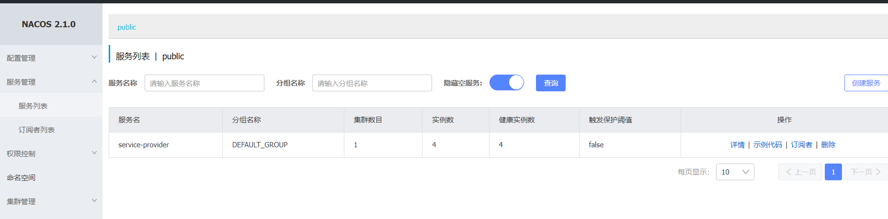
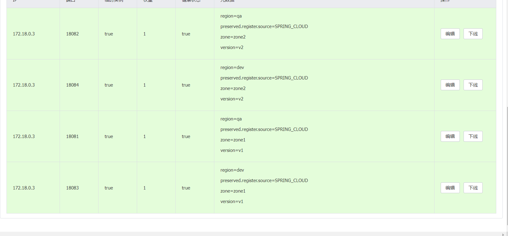
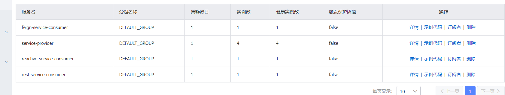
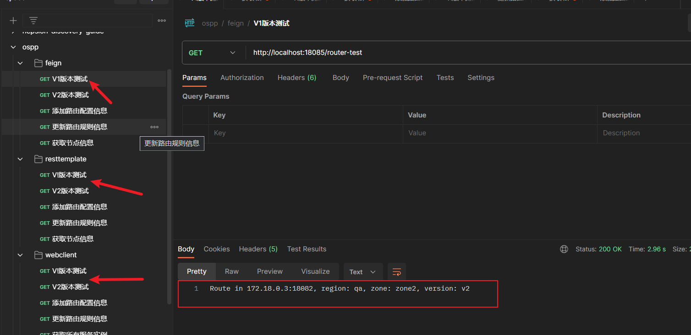
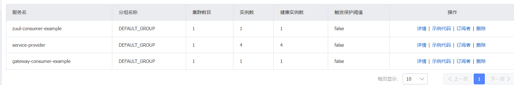
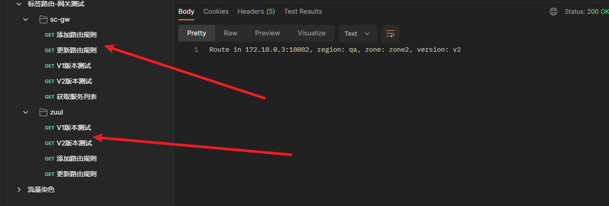

# Label Routing Docker-Compose Quickstart

This article will show an example of how Docker can be used to implement the label routing functionality of the Spring-Cloud-Alibaba (SCA) service governance functionality.

## 1. Environmental preparation

### 1.1 Prepare the service Jar package

1. Enter `spring-cloud-alibaba\spring-cloud-alibaba-examples` the directory and execute the `mvn clean package` packaged example service jar package

2. Enter the `spring-cloud-alibaba\spring-cloud-alibaba-examples\governance-example\label-routing-example\docker-compose-quickstart\routing-quickstart` directory and execute the following script to move the jar package to the specified directory;

   ```shell
   # linux/mac execute directly
   ./move-jar.sh
   
   # Use githu bash to execute under windows
   ,/move-jar.sh
   ```


3. Respectively enter `routing-gateway-consumer-example` `routing-service-provider-example` `routing-webClient-consumer-example` the (routing-quickstart subdirectory) directory to check `app.jar` whether it exists. If there is no manual movement;

4. Check that `application-docker.properties` the configuration file is accurate.

### 1.2 Install Docker

If there is no Docker and Docker-Compose in the local machine, please refer to the following link for installation.

- Docker：https://docs.docker.com/engine/install/
- Docker-Compose：https://docs.docker.com/compose/install/

### 1.3 Description of contents


```md
└─routing-quickstart
    │  .env										# Docker env settings
    │  .gitignore							
    │  docker-compose-env.yml					# service provider and nacos server
    │  docker-compose-gateway.yml				# gateway consumer example
    │  docker-compose-webClient.yml				# client consumer
    │  move-jar.sh								# move jar script
    │  README.md								# readme file
    │
    ├─assets
    │  └─img
    ├─routing-gateway-consumer-example
    │  │  DockerFile							# DockerFile file that starts the service consumer
    │  │
    │  ├─routing-gateway-consumer-example
    │  │      app.jar							# spring boot application jar 
    │  │      application-docker.properties		# Configuration file when the spring boot application is started in the docker container
    │  │
    │  └─routing-zuul-consumer-example
    │          app.jar
    │          application-docker.properties
    │
    ├─routing-service-provider-example			# service provider folder
    │      app.jar
    │      application-dockerA1.properties
    │      application-dockerA2.properties
    │      application-dockerA3.properties
    │      application-dockerA4.properties
    │      DockerFile
    │      start-provider.sh
    │
    └─routing-webClient-consumer-example		# Three types of request client consumer folders
        │  DockerFile
        │
        ├─routing-feign-consumer-example
        │      app.jar
        │      application-docker.properties
        │
        ├─routing-reactive-consumer-example
        │      app.jar
        │      application-docker.properties
        │
        └─routing-rest-consumer-example
                app.jar
                application-docker.properties
```


### 1.4 Postman Test Script

1. Enter `spring-cloud-alibaba\spring-cloud-alibaba-examples\governance-example\label-routing-example\routing-gateway-consumer-example\resources` the folder and import the gateway consumer request script into postman;
2. Go to `spring-cloud-alibaba\spring-cloud-alibaba-examples\governance-example\label-routing-example\routing-consumer-example\resources` the folder and import the client consumer request script into postman.

## 2. Start the service provider and the nacos server

1. Enter `spring-cloud-alibaba\spring-cloud-alibaba-examples\governance-example\label-routing-example\docker-compose-quickstart\routing-quickstart` the folder and enter the following command in the terminal to start the service-provider and nacos-server;

   ```shell
   # Build docker image
   docker-compose -f docker-compose-env.yml build
   
   # Start docker container
   docker-compose -f docker-compose-env.yml up -d
   
   # You can remove the last -d parameter and view the log output during service startup.
   docker-compose -f docker-compose-env.yml up
   ```

2. After a certain period of time (need to wait for the start of the docker container to be completed), the local machine accesses the nacos console address (http://127.0.0.1:8848/nacos) to view the service-provider that has been registered and launched, which contains four service instances.

   

3. If the above service registration information appears, it proves that the docker container is started successfully! Click Details to view the metadata information of the service provider instance.

   


## 3. Client service consumer examples

### 3.1Start the Service Consumer Container

1. Enter `spring-cloud-alibaba\spring-cloud-alibaba-examples\governance-example\label-routing-example\docker-compose-quickstart\routing-quickstart` the folder and execute the following command to start the example application container of the request client;

   ```shell
   # Build docker image
   docker-compose -f docker-compose-webClient.yml build
   
   # Start docker container
   docker-compose -f docker-compose-webClient.yml up -d
   
   # You can remove the last -d parameter and view the log output during service startup.
   docker-compose -f docker-compose-webClient.yml up
   ```

2. Go to nacos to check the service registration. After the service is online, the following message appears to prove that the container is started successfully;

   

3. Enter postman, initiate a request, and check whether the services can communicate **(No task routing rules are added, only ribbon is used for load balancing) ** normally;

   Click `v1版本测试` in the file and `v2版本测试` send the request without adding the routing configuration information respectively `feign` `rest` `webcleint` to check whether the four service providers can be consumed normally by the consumer:

   
   
   

Click respectively to check whether all the four instances are called according to the response value, and enter the next step after confirming the success. **(The default ribbon load balancing rule is ZoneAvoidanceRule) **

### 3.2 Publish routing rules to test label routing

> Take the feign client call as an example. Rest and WebClient are the same.

#### 3.2.1 Publish Routing Rule

> **Ensure that all four service providers can be called normally by consumers! **

1. Analysis of label route rule


   ```java
   // add routing rule
   @GetMapping("/add")
   public void getDataFromControlPlaneTest() {
       List<Rule> routeRules = new ArrayList<>();
       List<MatchService> matchServices = new ArrayList<>();
   
       UnifiedRoutingDataStructure unifiedRouteDataStructure = new UnifiedRoutingDataStructure();
       unifiedRouteDataStructure.setTargetService("service-provider");		# service-provider，The set rules only take effect for the service of this application name.
   
       RoutingRule labelRouteData = new RoutingRule();
       labelRouteData.setDefaultRouteVersion("v1");						# Set the default service version for routing
   
       Rule routeRule = new HeaderRoutingRule();							# Set the request header routing rule tag=v2, and route to the v2 service instance when such a request header exists
       routeRule.setCondition("=");				
       routeRule.setKey("tag");
       routeRule.setValue("v2");
       Rule routeRule1 = new UrlRoutingRule.ParameterRoutingRule();		# Request parameter routing rules, when id>10, route to v2 service instance
       routeRule1.setCondition(">");
       routeRule1.setKey("id");
       routeRule1.setValue("10");
       Rule routeRule2 = new UrlRoutingRule.PathRoutingRule();				# Route to v2 service instance when /router-test is requested
       routeRule2.setCondition("=");
       routeRule2.setValue("/router-test");
       routeRules.add(routeRule);
       routeRules.add(routeRule1);
       routeRules.add(routeRule2);
   
       MatchService matchService = new MatchService();						# Matching rules, set when the above conditions are met, route to v2 version, service weight is 100
       matchService.setVersion("v2");
       matchService.setWeight(100);
       matchService.setRuleList(routeRules);
       matchServices.add(matchService);
   
       labelRouteData.setMatchRouteList(matchServices);
   
       unifiedRouteDataStructure.setLabelRouteRule(labelRouteData);
   
       List<UnifiedRoutingDataStructure> unifiedRouteDataStructureList = new ArrayList<>();
       unifiedRouteDataStructureList.add(unifiedRouteDataStructure);
       applicationContext.publishEvent(
           new RoutingDataChangedEvent(this, unifiedRouteDataStructureList));
   }
   
   // update routing rule
   @GetMapping("/update")
   public void updateDataFromControlPlaneTest() {
       List<Rule> routeRules = new ArrayList<>();
       List<MatchService> matchServices = new ArrayList<>();
   
       UnifiedRoutingDataStructure unifiedRouteDataStructure = new UnifiedRoutingDataStructure();
       unifiedRouteDataStructure.setTargetService("service-provider");
   
       RoutingRule labelRouteData = new RoutingRule();
       labelRouteData.setDefaultRouteVersion("v1");
   
       Rule routeRule = new HeaderRoutingRule();
       routeRule.setCondition("=");
       routeRule.setKey("tag");
       routeRule.setValue("v2");
       Rule routeRule1 = new UrlRoutingRule.ParameterRoutingRule();
       routeRule1.setCondition(">");
       routeRule1.setKey("id");
       routeRule1.setValue("10");
       Rule routeRule2 = new UrlRoutingRule.PathRoutingRule();
       routeRule2.setCondition("=");
       routeRule2.setValue("/router-test");
       routeRules.add(routeRule);
       routeRules.add(routeRule1);
       routeRules.add(routeRule2);
   
       MatchService matchService = new MatchService();						# The other routing rules are the same, except that the weight of v2 is adjusted to 50, that is, half of the routes are routed to v1 and half are routed to the v2 version
       matchService.setVersion("v2");
       matchService.setWeight(50);
       matchService.setRuleList(routeRules);
       matchServices.add(matchService);
   
       labelRouteData.setMatchRouteList(matchServices);
   
       unifiedRouteDataStructure.setLabelRouteRule(labelRouteData);
   
       List<UnifiedRoutingDataStructure> unifiedRouteDataStructureList = new ArrayList<>();
       unifiedRouteDataStructureList.add(unifiedRouteDataStructure);
       applicationContext.publishEvent(
           new RoutingDataChangedEvent(this, unifiedRouteDataStructureList));
   }
   ```

2. Area Affinity Routing Resolution

   ```properties
   #ribbon polling rule, default ZoneAvoidanceRule
   #spring.cloud.governance.routing.rule=RandomRule
   
   # Regional affinity routing configuration
   #Set the region parameter called by the service consumer to dev and the available zone to zone1
   spring.cloud.governance.routing.region=dev
   spring.cloud.governance.routing.zone=zone1
   ```

#### 3.2.2 When Area Affinity Routing Rules Exist

1. Add a routing rule

   ```shell
   # expected outcome:
   # v1: Route in 172.18.0.3:18083, region: dev, zone: zone1, version: v1
   # v2: Observing the metadata of service-provider, it is found that there is no service instance with region=dev, zone=zone1, and version=v2. Therefore, regional affinity routing will degenerate into label routing effect. The following results are expected:
   # Route in 172.18.0.3:18082, region: qa, zone: zone2, version: v2
   # Route in 172.18.0.3:18084, region: dev, zone: zone2, version: v2
   
   # The test results match the expected results!
   ```

2. Update Routing Rule

   ```shell
   # expected outcome:
   # v1: Route in 172.18.0.3:18083, region: dev, zone: zone1, version: v1
   # v2: Because the regional affinity routing rules are set, even if the v1 and v2 versions have a weight of 50 each, the service instance will still be selected based on the regional affinity routing rules. The expected result is:
   # Route in 192.168.2.9:18083, region: dev, zone: zone1, version: v1
   
   # The test results match the expected results!
   ```

#### 3.2.3 When Area Affinity Routing Does Not Exist

> Note: Because the docker image is cached, it may not work if you repack it after commenting it out. Restart the docker service and try again!

To verify this scenario, you need to change the configuration file to unconfigure zone affinity routing. ** Execution `docker-compose -f docker-compose-webClient.yml stop` stops the consumer container. **

In the `spring-cloud-alibaba\spring-cloud-alibaba-examples\governance-example\label-routing-example\docker-compose-quickstart\routing-quickstart\routing-webClient-consumer-example\routing-feign-consumer-example\application-docker.properties` file, comment the zone affinity routing configuration: (Same for Rest and WebClient consumers)


```properties
# Regional affinity routing configuration
#spring.cloud.governance.routing.region=dev
#spring.cloud.governance.routing.zone=zone1
```

Rebuild and start the container.

1. Add a routing rule

   ```shell
   # expected outcome:
   # v1: Because there are no regional affinity routing restrictions, load balancing will be performed between instances according to ribbon rules.
   # Route in 172.18.0.3:18083, region: dev, zone: zone1, version: v1
   # Route in 172.18.0.3:18081, region: qa, zone: zone1, version: v1
   
   # v2: Because there are no regional affinity routing restrictions, load balancing will be performed between instances according to ribbon rules.
   # Route in 172.18.0.3:18084, region: qa, zone: zone2, version: v2
   # Route in 172.18.0.3:18082, region: dev, zone: zone2, version: v2
   
   # The test found that it met the expected results
   ```

2. Update Routing Rule

   ```shell
   # expected outcome
   # v1: Because there are no regional affinity routing restrictions, the routing results select service instances based on label routing, so load balancing is performed between the two instances according to ribbon rules.
   # Route in 172.18.0.3:18081, region: qa, zone: zone1, version: v1
   # Route in 172.18.0.3:18083, region: dev, zone: zone1, version: v1
     
   # v2: The weights of v1 and v2 each account for 50, so the calling results of the four service instances will appear.
   # Route in 172.18.0.3:18082, region: qa, zone: zone2, version: v2
   # Route in 172.18.0.3:18084, region: dev, zone: zone2, version: v2
   # Route in 172.18.0.3:18081, region: qa, zone: zone1, version: v1
   # Route in 172.18.0.3:18083, region: dev, zone: zone1, version: v1
   
   # The test found that it met the expected results
   ```

### 3.3 Close the container

Execute the following command to close the service consumer container:


```shell
docker-compose -f docker-compose-webClient.yml stop
```

## 4. Gateway Service Consumer Example

### 4.1Start the Gateway Service Consumer Container

1. Enter `spring-cloud-alibaba\spring-cloud-alibaba-examples\governance-example\label-routing-example\docker-compose-quickstart\routing-quickstart` the folder and execute the following command to start the example application container of the request client;

   ```shell
   # Build docker image
   docker-compose -f docker-compose-gateway.yml build
   
   # Start docker container
   docker-compose -f docker-compose-gateway.yml up -d
   
   # You can remove the last -d parameter and view the log output during service startup.
   docker-compose -f docker-compose-gateway.yml up
   ```

2. Go to nacos to check the service registration. After waiting for the service to go online, the following message appears to prove that the container is started successfully:

   

3. Enter postman, initiate a request, and check whether the services can communicate **(No task routing rules are added, only ribbon is used for load balancing) ** normally;

   Click `v1版本测试` in the file and `v2版本测试` send the request without adding the routing configuration information respectively `sc-gw` `zuul` to check whether the four service providers can be consumed normally by the consumer

   

Click respectively to check whether all the four instances are called according to the response value, and enter the next step after confirming the success. **(The default ribbon load balancing rule is RandomRule)**

### 4.2 Publish routing rules to test label routing

> **Take gateway as an example, the zuul gateway is the same!**

#### 4.1.1 Publish Routing Rule

1. Analysis of label route rule


   ```java
   @Override
   public void getDataFromControlPlaneTest() {
   
       log.info("请求 /add 接口，发布路由规则");
   
       List<Rule> routeRules = new ArrayList<>();
       List<MatchService> matchServices = new ArrayList<>();
   
       UnifiedRoutingDataStructure unifiedRouteDataStructure = new UnifiedRoutingDataStructure();
   
       // set target service
       unifiedRouteDataStructure.setTargetService("service-provider");
   
       RoutingRule labelRouteData = new RoutingRule();
   
       // set default service version
       labelRouteData.setDefaultRouteVersion("v1");
   
       // set request header routing rule
       Rule routeRule = new HeaderRoutingRule();
       routeRule.setCondition("=");
       routeRule.setKey("tag");
       routeRule.setValue("v2");
   
       // set request url routing rule
       Rule routeRule1 = new UrlRoutingRule.ParameterRoutingRule();
       routeRule1.setCondition(">");
       routeRule1.setKey("id");
       routeRule1.setValue("10");
   
       // set request url routing rule
       Rule routeRule2 = new UrlRoutingRule.PathRoutingRule();
       routeRule2.setCondition("=");
       routeRule2.setValue("/test-a1");								# The rules are the same as before, but because the service is called according to the gateway for consumption. So you need to specify the resource uri of the service provider
   
       // add routing rule to routeRules#List<Rule>
       routeRules.add(routeRule);
       routeRules.add(routeRule1);
       routeRules.add(routeRule2);
   
       // If the preceding conditions are met, the route is routed to the v2 instance and
       // the weight is set to 100
       MatchService matchService = new MatchService();
       matchService.setVersion("v2");
       matchService.setWeight(100);
       matchService.setRuleList(routeRules);
       matchServices.add(matchService);
   
       labelRouteData.setMatchRouteList(matchServices);
   
       unifiedRouteDataStructure.setLabelRouteRule(labelRouteData);
   
       List<UnifiedRoutingDataStructure> unifiedRouteDataStructureList = new ArrayList<>();
       unifiedRouteDataStructureList.add(unifiedRouteDataStructure);
   
       RoutingDataChangedEvent routingDataChangedEvent = new RoutingDataChangedEvent(
           this, unifiedRouteDataStructureList);
   
       // Publish routing rules
       applicationContext.publishEvent(routingDataChangedEvent);
   
       log.info("请求 /add 接口，发布路由规则完成！");
   
   }
   
   // The update rule is the same as the request client routing rule definition.
   public void updateDataFromControlPlaneTest() {
   
       log.info("请求 /update 接口，更新路由规则");
   
       List<Rule> routeRules = new ArrayList<>();
       List<MatchService> matchServices = new ArrayList<>();
   
       UnifiedRoutingDataStructure unifiedRouteDataStructure = new UnifiedRoutingDataStructure();
       unifiedRouteDataStructure.setTargetService("service-provider");
   
       RoutingRule labelRouteData = new RoutingRule();
       labelRouteData.setDefaultRouteVersion("v1");
   
       Rule routeRule = new HeaderRoutingRule();
       routeRule.setCondition("=");
       routeRule.setKey("tag");
       routeRule.setValue("v2");
       Rule routeRule1 = new UrlRoutingRule.ParameterRoutingRule();
       routeRule1.setCondition(">");
       routeRule1.setKey("id");
       routeRule1.setValue("10");
       Rule routeRule2 = new UrlRoutingRule.PathRoutingRule();
       routeRule2.setCondition("=");
       routeRule2.setValue("/test-a1");
       routeRules.add(routeRule);
       routeRules.add(routeRule1);
       routeRules.add(routeRule2);
   
       // set weight 50
       MatchService matchService = new MatchService();
       matchService.setVersion("v2");
       matchService.setWeight(50);
       matchService.setRuleList(routeRules);
       matchServices.add(matchService);
   
       labelRouteData.setMatchRouteList(matchServices);
   
       unifiedRouteDataStructure.setLabelRouteRule(labelRouteData);
   
       List<UnifiedRoutingDataStructure> unifiedRouteDataStructureList = new ArrayList<>();
       unifiedRouteDataStructureList.add(unifiedRouteDataStructure);
   
       applicationContext.publishEvent(
           new RoutingDataChangedEvent(this, unifiedRouteDataStructureList));
   
       log.info("请求 /update 接口，更新路由规则完成！");
   
   }
   ```

2. Area Affinity Routing Resolution	

   ```shell
   #ribbon polling rule, default ZoneAvoidanceRule
   #spring.cloud.governance.routing.rule=RandomRule
   
   # Regional affinity routing configuration
   #Set the region parameter called by the service consumer to dev and the available zone to zone1
   spring.cloud.governance.routing.region=dev
   spring.cloud.governance.routing.zone=zone1
   ```

#### 4.1.2 When Area Affinity Routing Rules Exist

1. Add a routing rule

   ```shell
   # expected outcome:
   # v1: Route in 172.18.0.3:18083, region: dev, zone: zone1, version: v1
   # v2: Observing the metadata of service-provider, it is found that there is no service instance with region=dev, zone=zone1, and version=v2. Therefore, regional affinity routing will degenerate into label routing effect. The following results are expected:
   # Route in 172.18.0.3:18082, region: qa, zone: zone2, version: v2
   # Route in 172.18.0.3:18084, region: dev, zone: zone2, version: v2
   
   # The test results match the expected results!
   ```

2. Update Routing Rule

   ```shell
   # expected outcome:
   # v1: Route in 172.18.0.3:18083, region: dev, zone: zone1, version: v1
   # v2: Because the regional affinity routing rules are set, even if the v1 and v2 versions have a weight of 50 each, the service instance will still be selected based on the regional affinity routing rules. The expected result is:
   # Route in 192.168.2.9:18083, region: dev, zone: zone1, version: v1
   
   # The test results match the expected results!
   ```

#### 4.1.3 When Area Affinity Routing Does Not Exist

> Note: Because the docker image is cached, it may not take effect after being commented out. Restart the docker service and try again!

To verify this scenario, you need to change the configuration file to unconfigure zone affinity routing. ** Execution `docker-compose -f docker-compose-webClient.yml stop` stops the consumer container. **

In the `spring-cloud-alibaba\spring-cloud-alibaba-examples\governance-example\label-routing-example\docker-compose-quickstart\routing-quickstart\routing-gateway-consumer-example\routing-gateway-consumer-example\application-docker.properties` file, comment the zone affinity routing configuration: (the same goes for the Zuul gateway consumer)


```properties
# Regional affinity routing configuration
#spring.cloud.governance.routing.region=dev
#spring.cloud.governance.routing.zone=zone1
```

Rebuild and start the container.

1. Add a routing rule

   ```shell
   # expected outcome:
   # v1: Because there are no regional affinity routing restrictions, load balancing will be performed between instances according to ribbon rules.
   # Route in 172.18.0.3:18083, region: dev, zone: zone1, version: v1
   # Route in 172.18.0.3:18081, region: qa, zone: zone1, version: v1
   
   # v2: Because there are no regional affinity routing restrictions, load balancing will be performed between instances according to ribbon rules.
   # Route in 172.18.0.3:18084, region: qa, zone: zone2, version: v2
   # Route in 172.18.0.3:18082, region: dev, zone: zone2, version: v2
   
   # The test found that it met the expected results
   ```

2. Update Routing Rule

   ```shell
   # expected outcome
   # v1: Because there are no regional affinity routing restrictions, the routing results select service instances based on label routing, so load balancing is performed between the two instances according to ribbon rules.
   # Route in 172.18.0.3:18081, region: qa, zone: zone1, version: v1
   # Route in 172.18.0.3:18083, region: dev, zone: zone1, version: v1
     
   # v2: The weights of v1 and v2 each account for 50, so the calling results of the four service instances will appear.
   # Route in 172.18.0.3:18082, region: qa, zone: zone2, version: v2
   # Route in 172.18.0.3:18084, region: dev, zone: zone2, version: v2
   # Route in 172.18.0.3:18081, region: qa, zone: zone1, version: v1
   # Route in 172.18.0.3:18083, region: dev, zone: zone1, version: v1
   
   # The test found that it met the expected results
   ```

### 4.3 Close the container

Execute the following command to close the service consumer container:


```shell
docker-compose -f docker-compose-gateway.yml stop
```

## 5. Service container removal

1. Execute the following command to stop the running service provider and nacos server container

   ```shell
   docker-compose -f docker-compose-env.yml stop
   ```

2. Execute the following command to remove all containers and mirror

   ```shell
   # Delete images after filtering by conditions
   docker rmi `docker images | grep sca-routing-** | awk ‘{print $1}’` -f
   
   # Delete containers after filtering by conditions
   docker rm `docker ps -a | grep sca-routing-** | awk '{print $1}'`
   ```

   
