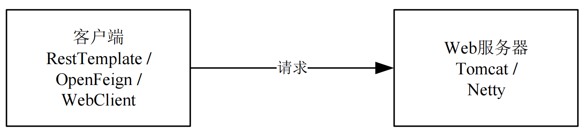

# Mtls Example

## 项目说明

本项目演示如何利用 Istio 下发的证书实现Spring Cloud Alibaba（下文简称：SCA）应用之间的双向TLS能力。目前对于服务端支持Spring MVC以及Spring WebFlux应用的适配，并针对feign，resttemplate等客户端的实现，提供了具有热更新能力的ssl上下文，配置后可自动进行istio证书的更新。

## 准备

### 安装K8s环境

请参考K8s的[安装工具](https://kubernetes.io/zh-cn/docs/tasks/tools/)小节。

### 在K8s上安装并启用Istio

请参考Istio官方文档的[安装](https://istio.io/latest/zh/docs/setup/install/)小节。

## 示例

### 如何接入

在启动示例进行演示之前，先了解一下应用如何接入Istio并及加载证书。 注意本章节只是为了便于理解接入方式，本示例代码中已经完成接入工作，您无需再进行修改。

1. 修改`pom.xml`文件，引入Istio规则Adapter以及mtls模块:

```xml
<dependency>
    <groupId>com.alibaba.cloud</groupId>
    <artifactId>spring-cloud-starter-xds-adapter</artifactId>
</dependency>
<dependency>
    <groupId>com.alibaba.cloud</groupId>
    <artifactId>spring-cloud-starter-mtls</artifactId>
</dependency>
```

2. 参照[文档](https://github.com/alibaba/spring-cloud-alibaba/blob/2.2.x/spring-cloud-alibaba-docs/src/main/asciidoc-zh/governance.adoc)，实现与`Istio`控制面的对接

### 效果演示



下面以RestTemplate客户端及Tomcat服务器为例，给出简单的使用示例。

通过如下命令加载具有热更新能力的SSL上下文：

```shell
curl -k https://localhost:8111/checkpreload
```

通过RestTemplate客户端请求Tomcat服务器：

```shell
curl -k -v https://localhost:8111/resttemplate/getMvc
```

请求成功，Tomcat服务器将会收到客户端所携带的证书。证书中包含应用的身份信息，即service account name。某次请求中收到的客户端证书如下：


curl -v命令收到返回的Tomcat服务器证书如下：


可以通过以下命令加载本地证书，更新证书配置：

```shell
curl -k https://localhost:8111/reload
```

