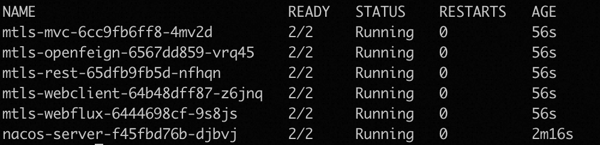
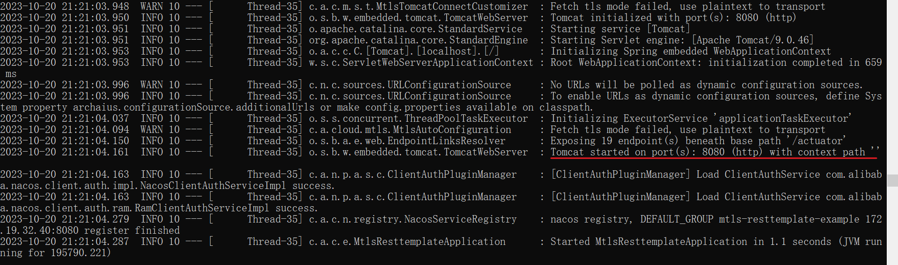
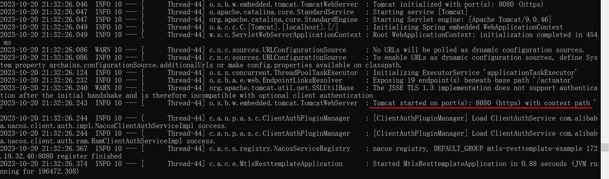
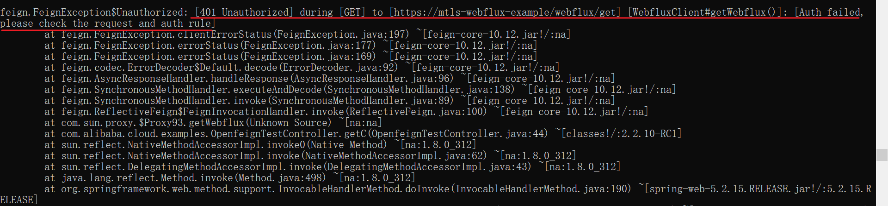

# Mtls Example

## Project Instruction

This project demonstrates how to utilize Istio issued certificates to achieve mutual TLS capability between Spring Cloud Alibaba (hereinafter referred to as: SCA) applications. Currently for the server-side support for Spring MVC and Spring WebFlux application adaptation , and for feign, resttemplate and other client-side implementation , provides a hot update capability of the ssl context , the configuration can be automatically updated istio certificate.

## Preparation

### Install K8s

Please refer to [tools](https://kubernetes.io/docs/tasks/tools/) chapter of K8s document.

### Install Helm

Refer to the Helm [[Installation Guide]](https://helm.sh/docs/intro/install/).

### Enable Istio on K8s

Please refer to [install](https://istio.io/latest/docs/setup/install/) chapter of Istio document.

### Application Deployment

Deploy the sample project mtls-example in K8s with the following command:

```shell
helm install mtls-demo .
```

After successful deployment, view the pod information as follows:



## Demo

### Connect to Istio

Before launching the example for demonstration, let's look at how a Spring Cloud application accesses Istio and provides authentication. This section is only for you to understand how to use it. The config has been filled in this example and you may not need to modify it.

1. Modify the `pom.xml` file to introduce the Istio rules adapter, the mtls module, the governance-auth module, and the actuator dependency:

```xml
<dependency>
    <groupId>com.alibaba.cloud</groupId>
    <artifactId>spring-cloud-starter-xds-adapter</artifactId>
</dependency>
<dependency>
    <groupId>com.alibaba.cloud</groupId>
    <artifactId>spring-cloud-starter-alibaba-governance-mtls</artifactId>
</dependency>
<dependency>
	<groupId>com.alibaba.cloud</groupId>
	<artifactId>spring-cloud-starter-alibaba-governance-auth</artifactId>
</dependency>
<dependency>
	<groupId>org.springframework.boot</groupId>
	<artifactId>spring-boot-starter-actuator</artifactId>
</dependency>
```

2. Refer to the [documentation](https://github.com/alibaba/spring-cloud-alibaba/blob/2.2.x/spring-cloud-alibaba-docs/src/main/asciidoc/mtls.adoc) for the implementation of the interface with the ` Istio` control plane and Service Account configuration.

### Quick Start

#### View Certificates

After deploying the sample application to K8s and configuring the Service Account of the application, in the pod where the application resides, you can view the certificates issued for the current application with the following command:

```shell
openssl s_client -connect 127.0.0.1:${port} </dev/null 2>/dev/null | openssl x509 -inform pem -text
```

Taking the SpringMVC (Tomcat) server as an example, you can see the spiffe encoded ServiceAccount content to be used as the Subject Alternative Name:

```
Certificate:
    Data:
        Version: 3 (0x2)
        Serial Number:
            6a:e4:29:15:41:94:75:67:3c:7f:85:26:ff:37:3d:55
        Signature Algorithm: sha256WithRSAEncryption
        Issuer: O = cluster.local
        Validity
            Not Before: Oct 20 06:55:54 2023 GMT
            Not After : Oct 21 06:57:54 2023 GMT
        Subject:
        Subject Public Key Info:
            Public Key Algorithm: rsaEncryption
                RSA Public-Key: (2048 bit)
                Modulus:
                    00:d3:a8:31:78:82:d3:fb:a4:01:2e:02:c3:70:86:
                    fb:f4:e3:f8:42:fc:4e:ce:97:d0:5a:6a:b9:1b:eb:
                    fd:2c:ad:16:4c:8a:12:a0:23:fe:ea:3c:7d:3f:3f:
                    6b:b5:6c:c5:d3:fe:f5:09:68:b9:03:c7:1d:08:ef:
                    96:e3:1a:60:b2:5e:9c:c6:ff:13:42:14:08:0c:fc:
                    66:28:98:65:d2:49:ef:9f:d8:c3:be:70:12:12:24:
                    d6:25:5d:99:eb:63:4e:19:51:13:c9:09:73:79:b8:
                    ac:07:ee:a2:99:75:62:bb:f6:32:48:da:fb:69:32:
                    cc:cf:f1:7e:ef:e8:dd:8f:88:b2:c3:cb:73:b0:ed:
                    a6:60:e2:3c:e1:b2:7e:f4:9d:ad:1c:be:9d:ba:1b:
                    1a:e4:0c:a8:a7:a6:ea:f5:f6:96:47:74:77:bd:fa:
                    4a:5f:bd:05:9b:8b:e7:d5:49:27:22:30:5b:79:e2:
                    62:a8:71:60:36:8a:a6:79:41:76:0a:af:db:8f:fb:
                    e4:f3:fa:19:3c:bd:49:48:39:96:7f:16:24:0e:c6:
                    0d:20:01:9c:70:32:cd:1d:92:32:e0:b3:72:bb:1a:
                    78:ac:49:b2:ff:90:36:4d:d0:d0:e8:5c:02:05:7c:
                    c7:b9:a8:99:72:0e:48:8c:f5:41:7d:ce:8d:92:73:
                    2c:3b
                Exponent: 65537 (0x10001)
        X509v3 extensions:
            X509v3 Key Usage: critical
                Digital Signature, Key Encipherment
            X509v3 Extended Key Usage:
                TLS Web Server Authentication, TLS Web Client Authentication
            X509v3 Basic Constraints: critical
                CA:FALSE
            X509v3 Authority Key Identifier:
                keyid:9D:4E:93:61:65:5B:47:8B:E5:B4:1D:6C:A7:06:9E:35:AD:9B:8A:0B

            X509v3 Subject Alternative Name: critical
                URI:spiffe://cluster.local/ns/default/sa/mtls-resttemplate-example
    Signature Algorithm: sha256WithRSAEncryption
         6f:ad:f8:d2:e1:1e:45:99:63:9e:0a:6c:06:28:14:fb:7f:f6:
         6d:c2:4c:e6:2f:43:28:34:5e:a2:16:88:0d:1c:fb:80:d3:bd:
         72:7e:cc:63:4a:91:54:33:e9:0d:bb:bc:92:46:13:68:0a:9f:
         83:25:9c:0d:8a:cd:8f:41:d4:f3:c5:b6:48:39:04:da:9e:7a:
         51:00:3c:34:15:c5:20:c9:00:d1:ac:53:4e:3a:6c:68:a6:6c:
         8a:1d:c0:e6:13:06:45:56:13:d5:6e:72:e1:83:a8:34:2b:12:
         27:2e:0f:d4:9f:89:d2:8f:24:76:53:62:ff:3a:32:0a:c6:4a:
         ca:d1:dc:aa:39:93:dd:c6:66:c3:89:1d:46:69:2f:a8:7c:42:
         d5:d7:29:81:c3:d7:07:43:bd:aa:4d:04:52:5e:9e:15:fc:6b:
         97:e3:b0:4a:b6:3f:cf:c7:47:b8:41:8f:a1:81:c1:12:16:48:
         87:41:3f:fb:88:a2:ce:11:18:54:11:b9:5a:d2:1f:2f:93:dc:
         de:a9:d0:2f:7c:0d:be:1c:6f:3a:15:a3:16:d1:91:2e:c7:33:
         83:ed:84:25:18:1d:6c:7f:9b:4d:6d:da:06:8d:30:a6:7d:f9:
         8d:24:28:45:17:50:98:c9:e3:13:ae:44:f8:df:07:7b:f3:9a:
         d1:e0:7a:80
-----BEGIN CERTIFICATE-----
MIIDUjCCAjqgAwIBAgIQauQpFUGUdWc8f4Um/zc9VTANBgkqhkiG9w0BAQsFADAY
MRYwFAYDVQQKEw1jbHVzdGVyLmxvY2FsMB4XDTIzMTAyMDA2NTU1NFoXDTIzMTAy
MTA2NTc1NFowADCCASIwDQYJKoZIhvcNAQEBBQADggEPADCCAQoCggEBANOoMXiC
0/ukAS4Cw3CG+/Tj+EL8Ts6X0FpquRvr/SytFkyKEqAj/uo8fT8/a7VsxdP+9Qlo
uQPHHQjvluMaYLJenMb/E0IUCAz8ZiiYZdJJ75/Yw75wEhIk1iVdmetjThlRE8kJ
c3m4rAfuopl1Yrv2Mkja+2kyzM/xfu/o3Y+IssPLc7DtpmDiPOGyfvSdrRy+nbob
GuQMqKem6vX2lkd0d736Sl+9BZuL59VJJyIwW3niYqhxYDaKpnlBdgqv24/75PP6
GTy9SUg5ln8WJA7GDSABnHAyzR2SMuCzcrsaeKxJsv+QNk3Q0OhcAgV8x7momXIO
SIz1QX3OjZJzLDsCAwEAAaOBrzCBrDAOBgNVHQ8BAf8EBAMCBaAwHQYDVR0lBBYw
FAYIKwYBBQUHAwEGCCsGAQUFBwMCMAwGA1UdEwEB/wQCMAAwHwYDVR0jBBgwFoAU
nU6TYWVbR4vltB1spwaeNa2bigswTAYDVR0RAQH/BEIwQIY+c3BpZmZlOi8vY2x1
c3Rlci5sb2NhbC9ucy9kZWZhdWx0L3NhL210bHMtcmVzdHRlbXBsYXRlLWV4YW1w
bGUwDQYJKoZIhvcNAQELBQADggEBAG+t+NLhHkWZY54KbAYoFPt/9m3CTOYvQyg0
XqIWiA0c+4DTvXJ+zGNKkVQz6Q27vJJGE2gKn4MlnA2KzY9B1PPFtkg5BNqeelEA
PDQVxSDJANGsU046bGimbIodwOYTBkVWE9VucuGDqDQrEicuD9SfidKPJHZTYv86
MgrGSsrR3Ko5k93GZsOJHUZpL6h8QtXXKYHD1wdDvapNBFJenhX8a5fjsEq2P8/H
R7hBj6GBwRIWSIdBP/uIos4RGFQRuVrSHy+T3N6p0C98Db4cbzoVoxbRkS7HM4Pt
hCUYHWx/m01t2gaNMKZ9+Y0kKEUXUJjJ4xOuRPjfB3vzmtHgeoA=
-----END CERTIFICATE-----
```

#### Mutual TLS

The following RestTemplate client and SpringMVC (Tomcat) server as an example, to give a simple example of use.

Deploy the sample application to K8s and enter the RestTemplate application with the following command:

```shell
kubectl exec -c istio-proxy -it ${resttemplate_pod_name} -- bash
```

Use the following command within the container to send a request to the Tomcat server via the RestTemplate client:

```shell
curl -k https://localhost:${port}/resttemplate/getMvc
```

After a successful request, the SpringMVC (Tomcat) server will receive the certificate carried by the client. The certificate contains information about the identity of the application, i.e. ServiceAccount. The client certificate received can be found by viewing the logs of the pod where the server is located with the following command:

```shell
kubectl logs ${springmvc_pod_name}
```

The client certificate received in one of the requests is as follows. From the SubjectAlternativeName field in the certificate, you can identify that the certificate is from the application with ServiceAccount "mtls-resttemplate-example":

```
[
[
  Version: V3
  Subject:
  Signature Algorithm: SHA256withRSA, OID = 1.2.840.113549.1.1.11

  Key:  Sun RSA public key, 2048 bits
  params: null
  modulus: 26719221528184068732015315264288604373679826539282478426097969053974382861354826542051876328932528175642713092529641146295102033253211316495853946817283249533389050199752927749843698539537721469963691881711082844075757454244576898594432695045339671702416660979527239503695271512833660067801224544638113738271334257178208382924689930111364189968004443796717959536203482853831898504813939931700174503652220712246767390007530274164485324125515933992826096083933791713331987686469400680968433332825899402171823122204857159285181103975487627104678111438273834092923367973802365694241887849829238593076455058952257637919803
  public exponent: 65537
  Validity: [From: Fri Oct 20 14:55:54 CST 2023,
               To: Sat Oct 21 14:57:54 CST 2023]
  Issuer: O=cluster.local
  SerialNumber: [    6ae42915 41947567 3c7f8526 ff373d55]

Certificate Extensions: 5
[1]: ObjectId: 2.5.29.35 Criticality=false
AuthorityKeyIdentifier [
KeyIdentifier [
0000: 9D 4E 93 61 65 5B 47 8B   E5 B4 1D 6C A7 06 9E 35  .N.ae[G....l...5
0010: AD 9B 8A 0B                                        ....
]
]

[2]: ObjectId: 2.5.29.19 Criticality=true
BasicConstraints:[
  CA:false
  PathLen: undefined
]

[3]: ObjectId: 2.5.29.37 Criticality=false
ExtendedKeyUsages [
  serverAuth
  clientAuth
]

[4]: ObjectId: 2.5.29.15 Criticality=true
KeyUsage [
  DigitalSignature
  Key_Encipherment
]

[5]: ObjectId: 2.5.29.17 Criticality=true
SubjectAlternativeName [
  URIName: spiffe://cluster.local/ns/default/sa/mtls-resttemplate-example
]

]
  Algorithm: [SHA256withRSA]
  Signature:
0000: 6F AD F8 D2 E1 1E 45 99   63 9E 0A 6C 06 28 14 FB  o.....E.c..l.(..
0010: 7F F6 6D C2 4C E6 2F 43   28 34 5E A2 16 88 0D 1C  ..m.L./C(4^.....
0020: FB 80 D3 BD 72 7E CC 63   4A 91 54 33 E9 0D BB BC  ....r..cJ.T3....
0030: 92 46 13 68 0A 9F 83 25   9C 0D 8A CD 8F 41 D4 F3  .F.h...%.....A..
0040: C5 B6 48 39 04 DA 9E 7A   51 00 3C 34 15 C5 20 C9  ..H9...zQ.<4.. .
0050: 00 D1 AC 53 4E 3A 6C 68   A6 6C 8A 1D C0 E6 13 06  ...SN:lh.l......
0060: 45 56 13 D5 6E 72 E1 83   A8 34 2B 12 27 2E 0F D4  EV..nr...4+.'...
0070: 9F 89 D2 8F 24 76 53 62   FF 3A 32 0A C6 4A CA D1  ....$vSb.:2..J..
0080: DC AA 39 93 DD C6 66 C3   89 1D 46 69 2F A8 7C 42  ..9...f...Fi/..B
0090: D5 D7 29 81 C3 D7 07 43   BD AA 4D 04 52 5E 9E 15  ..)....C..M.R^..
00A0: FC 6B 97 E3 B0 4A B6 3F   CF C7 47 B8 41 8F A1 81  .k...J.?..G.A...
00B0: C1 12 16 48 87 41 3F FB   88 A2 CE 11 18 54 11 B9  ...H.A?......T..
00C0: 5A D2 1F 2F 93 DC DE A9   D0 2F 7C 0D BE 1C 6F 3A  Z../...../....o:
00D0: 15 A3 16 D1 91 2E C7 33   83 ED 84 25 18 1D 6C 7F  .......3...%..l.
00E0: 9B 4D 6D DA 06 8D 30 A6   7D F9 8D 24 28 45 17 50  .Mm...0....$(E.P
00F0: 98 C9 E3 13 AE 44 F8 DF   07 7B F3 9A D1 E0 7A 80  .....D........z.

]
```

#### Traffic Mode Switching

Dynamically switching the traffic mode to http can be achieved with the following command:

```shell
curl -k 'https://localhost:${port}/actuator/sds' --header 'Content-Type: application/json' --data '{ "isTls":false }'
```

Observing the application logs, you can see that the application was started in http mode:



Switch the traffic pattern to https:

```shell
curl -k 'http://localhost:${port}/actuator/sds' --header 'Content-Type: 
application/json' --data '{ "isTls":true }'
```

Observing the application logs, you can see that the application was started in https mode:



### AuthorizationPolicy principal

Take the example of an Openfeign client requesting a Webflux (Netty) server, and configure the following authorization policy for the application on the pod where the Webflux (Netty) application resides, i.e., allow access to the service with the service account "cluster.local/ns/default/sa/mtls-openfeign-example":

```yaml
apiVersion: security.istio.io/v1beta1
kind: AuthorizationPolicy
metadata:
 name: httpbin
 namespace: default
spec:
 action: ALLOW
 rules:
 - from:
   - source:
       principals: ["cluster.local/ns/default/sa/mtls-openfeign-example"]
```

Use the following command within the container to send a request to the Webflux (Netty) server via the Openfeign client:

```shell
curl -k https://localhost:${port}/openfeign/getWebflux
```

Server Response:

```
webflux-server received request from client
```

Update the authorization policy as follows to deny access from services with service account "cluster.local/ns/default/sa/mtls-openfeign-example":

```yaml
apiVersion: security.istio.io/v1beta1
kind: AuthorizationPolicy
metadata:
 name: httpbin
 namespace: default
spec:
 action: ALLOW
 rules:
 - from:
   - source:
       principals: ["cluster.local/ns/default/sa/mtls-openfeign-example"]
```

Send the request to the Webflux (Netty) server again, the request fails, check the client application logs and you can see that the request is not authorized.

